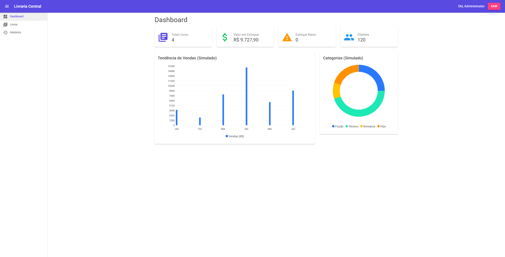
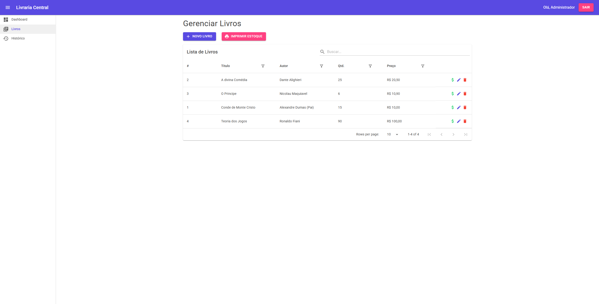

 # 📚 Livraria Central - Sistema de Gestão Full Stack
 


 
 
 
 

 > **Uma solução completa para gerenciamento de livrarias, desenvolvida com as tecnologias mais modernas do ecossistema .NET.**

 ## 💡 Sobre o Projeto (Parte 1)

 Este projeto é uma aplicação **Full Stack** robusta desenvolvida para simular o ambiente real de uma livraria. O objetivo foi criar não apenas um CRUD, mas um sistema funcional com regras de negócio, autenticação segura, relatórios e auditoria.

 Ele serve como:
 1.  **Portfólio Técnico:** Demonstrando domínio em arquitetura de software, Clean Code e padrões de mercado.
 2.  **Material Didático:** Um guia passo a passo (abaixo) para desenvolvedores que desejam aprender a construir aplicações reais com .NET.

 ## 🗺️ Roadmap do Projeto

 Este repositório representa a **Parte 1** de uma série de estudos avançados. O objetivo é demonstrar a evolução de um software funcional para uma solução Enterprise escalável.

 | Fase | Foco | Status | Descrição |
 | :--- | :--- | :--- | :--- |
 | **Parte 1** | **MVP Funcional** | ✅ | Construção da aplicação completa (Back + Front + Banco), focado em entrega de valor e funcionalidades (Vendas, Auth, PDF, Logs). |
 | **Parte 2** | **Arquitetura & Qualidade** | Em Breve | Refatoração para **Clean Architecture**, implementação de **Testes Unitários** (xUnit), Padrão Repository, DTOs com AutoMapper e validações avançadas. Transformando o código para nível Pleno/Sênior. |
 | **Parte 3** | **Cloud & DevOps** | Em Breve | Migração para **Microsoft Azure**, configuração de Pipeline de **CI/CD** (GitHub Actions), Dockerização e gestão de segredos em nuvem. |

 ## 🛠️ Tecnologias Utilizadas

 * **Backend:** .NET 10 (Web API), Entity Framework Core.
 * **Frontend:** Blazor WebAssembly, MudBlazor (Material Design).
 * **Banco de Dados:** PostgreSQL 18.
 * **Segurança:** JWT (JSON Web Tokens), BCrypt (Hash de Senhas).
 * **Relatórios:** QuestPDF (Geração de PDFs profissionais).
 * **Observabilidade:** Serilog (Logs estruturados e auditoria).
 * **Deploy:** Configuração para Windows Service (IIS) e Linux (Nginx + Systemd).

 ## ✨ Funcionalidades Principais

 ✅ **Dashboard Interativo:** Gráficos de vendas e indicadores de estoque em tempo real.  
 ✅ **Gestão de Livros:** Cadastro, edição e exclusão com validações.  
 ✅ **Ponto de Venda (PDV):** Registro de vendas com baixa automática de estoque.  
 ✅ **Segurança:** Login, proteção de rotas e criptografia de senhas.  
 ✅ **Auditoria:** Logs detalhados de quem fez o quê (ex: "Usuário X excluiu o livro Y").  
 ✅ **Relatórios:** Exportação de listagem de estoque em PDF pronto para impressão.  

 ## 📸 Pré-visualização

  | Dashboard | Gestão de Livros |
 |:---:|:---:|
 |  |  |

 ## 🚀 Quick Start (Como Rodar)

 Se você quer apenas testar o projeto rapidamente:

 1.  **Clone o repositório:**
     ```bash
     git clone [https://github.com/seu-usuario/LivrariaCentral.git](https://github.com/seu-usuario/LivrariaCentral.git)
     ```
 2.  **Configure o Banco:** Garanta que o PostgreSQL esteja rodando e ajuste a ConnectionString no `appsettings.json` com as informações necessarias para conectar ao banco.

 3.  **Rode a API:** Execute os comandos dotnet run (API e WEB) simultaneamente em dois terminais .

     ```bash
     cd src/LivrariaCentral.API
     dotnet run
     ```
 4.  **Rode o Frontend:**
     ```bash
     cd src/LivrariaCentral.Web
     dotnet run
     ```
 5.  **Acesse:** Cada terminal irá retornar um localhost:xxxx (o valor da porta pode variar e será visivel no terminal, substitua o 'xxxx' pelo valor informado).

     Informe o localhost na barra de pesquisa do navegador (exemplo: google chrome)
 
     utilize o localhost WEB (`http://localhost:xxxx`) para acessar a interface do sistema.  
     utilize o localhost API (`http://localhost:xxxx/swagger`) para acessar o swagger e consultar os endpoints.


 # 📖 Guia de Desenvolvimento Passo a Passo

 *Abaixo encontra-se a documentação técnica utilizada durante o desenvolvimento, ideal para fins de estudo.*


 ## 🚀 Sessão 1: Configuração do Ambiente

 ### 1. Infraestrutura

 Para o Projeto será necessário ter o postgreSQL e o .NET SDK 10
 - Banco de Dados: PostgreSQL 18. (Necessita Instalar)
 - Versão do .NET SDK: 10.0.102. (Necessita Instalar)
 - .NET WebApi.
 - .NET Blazor e mudBlazor.


 ## 🚀 Sessão 2: Criação da API

 ### 1. Criação da pasta Source

 (Todos os comandos a seguir são utilizados )

 Criação da pasta "src" na raiz para organizar o código fonte.

 ```bash
 mkdir src
 ```

 ### 2. Estrutura inicial da API
 Comando .NET para criação de um novo projeto WebApi (Back-end).

 ```bash
 cd src
 dotnet new webapi -n LivrariaCentral.API
 ```

 ### 3. Instalação de Pacotes
 Instale as versões gerenciadas automaticamente pelo .NET SDK 10 utilizando o terminal.

 ```bash
 cd LivrariaCentral.API 
 dotnet add package Microsoft.EntityFrameworkCore
 dotnet add package Microsoft.EntityFrameworkCore.Design
 dotnet add package Npgsql.EntityFrameworkCore.PostgreSQL
 ```

 > **Obs:** Caso esteja utilizando o .NET SDK 9, adicione ` --version 9.0.0` ao final de cada linha.

**O que cada pacote faz:**
 * **EntityFrameworkCore:** É o núcleo do ORM. Ele permite que manipulemos o banco de dados usando classes e códigos C# em vez de escrever SQL puro.
 * **EntityFrameworkCore.Design:** Contém as ferramentas necessárias para rodar os comandos de **Migration** e scaffolding no terminal.
 * **Npgsql...PostgreSQL:** É o "driver" (ou provedor) que ensina o Entity Framework a se comunicar especificamente com o banco **PostgreSQL**.  


 ## 🚀 Sessão 3: Configuração da API

 ### 1. Modelagem de Dados (Code-First)

 Acesse a pasta do projeto API e crie as pastas organizacionais.

 ```bash
 cd LivrariaCentral.API #apenas se necesário
 mkdir Models
 mkdir Data
 ```

 ### 2. Entidade

 Como estamos gerenciando uma Livraria, precisamos definir a entidade livro.
 
 **Crie o arquivo `Livro.cs` dentro da pasta `Models`.**
 
 Representa a entidade de negócio "Livro". O Entity Framework usará esta classe para criar a tabela `Livros` no banco de dados, onde cada propriedade se tornará uma coluna (ex: `Titulo` vira `varchar`, `Preco` vira `numeric`).

 ```csharp
 namespace LivrariaCentral.API.Models;

 public class Livro
 {
     public int Id { get; set; }
     public string Titulo { get; set; } = string.Empty; //string.Empty permite a coluna receber valores Nulos
     public string Autor { get; set; } = string.Empty; //string.Empty permite a coluna receber valores Nulos
     public decimal Preco { get; set; } // Dinheiro sempre é tratado com decimal ao invés de float ou double
     public int Estoque { get; set; }
     public DateTime DataCadastro { get; set; } = DateTime.UtcNow; //A coluna recebe o horario universal atual
 }
 ```

 > **Nota:** Alguns projetos optam por utilizar "Entities" em vez de "Models" no nome da pasta.

 ### 3. Contexto de Banco de Dados

 **Crie o arquivo `AppDbContext.cs` dentro da pasta `Data`.**  

 Atua como a ponte principal entre o código C# e o PostgreSQL. Ele herda de `DbContext` e é responsável por gerenciar a conexão, mapear as classes para tabelas e traduzir as consultas LINQ para comandos SQL.

 ```csharp
 using Microsoft.EntityFrameworkCore;
 using LivrariaCentral.API.Models;

 namespace LivrariaCentral.API.Data;

 public class AppDbContext : DbContext
 {
     public AppDbContext(DbContextOptions<AppDbContext> options) : base(options) { }

     // Define que a classe Livro será uma tabela chamada "Livros"
     public DbSet<Livro> Livros { get; set; }
 }
 ```

 ### 4. Configuração da Aplicação (Connection String)

 Define as credenciais para acessar o banco de dados.  

 **Altere o arquivo `appsettings.json` na raiz de `LivrariaCentral.API` para:**  

 ```json
 {
   "Logging": {
     "LogLevel": {
       "Default": "Information",
       "Microsoft.AspNetCore": "Warning"
     }
   },
   "AllowedHosts": "*",
   "ConnectionStrings": {
     "DefaultConnection": "Host=localhost;Port=5432;Database={NomeDoBanco};Username=postgres;Password={SuaSenhaDoPostgreSQL}"
   }
 }
 ```

 > **Nota:** Não esqueça de trocar os valores de Database e Password.

 **Exemplo:**

 ```json
 {
   "Logging": {
     "LogLevel": {
       "Default": "Information",
       "Microsoft.AspNetCore": "Warning"
     }
   },
   "AllowedHosts": "*",
   "ConnectionStrings": {
     "DefaultConnection": "Host=localhost;Port=5432;Database=LivrariaCentral;Username=postgres;Password=admin"
   }
 }
 ```

 ### 5. Configuração dos Serviços (Program.cs)

Utilize o comando no terminal dentro de LivrariaCentral.API

 ```bash
 cd src/LivrariaCentral.API #apenas se necesário
 dotnet add package Swashbuckle.AspNetCore
 ```

 Esse pacote é o responsável por gerar a documentação automática e a tela de testes da sua API, também conhecido como `Swagger`

 Substitua todo o conteúdo do arquivo `Program.cs` pelo código abaixo. Ele configura a Injeção de Dependência do Banco, ativa os Controllers e o Swagger.

 ```csharp
 using LivrariaCentral.API.Data;
 using Microsoft.EntityFrameworkCore;

 var builder = WebApplication.CreateBuilder(args);

 // --- 1. CONFIGURAÇÃO DO BANCO (POSTGRES) ---

 // Lê a string de conexão do appsettings.json
 var connectionString = builder.Configuration.GetConnectionString("DefaultConnection");

 // Registra o AppDbContext na injeção de dependência usando Npgsql
 builder.Services.AddDbContext<AppDbContext>(options =>
     options.UseNpgsql(connectionString));

 // --------------------------------------------

 // Adiciona suporte a Controllers (API)
 builder.Services.AddControllers();

 // Adiciona suporte ao Swagger (Documentação da API)
 builder.Services.AddEndpointsApiExplorer();
 builder.Services.AddSwaggerGen();

 var app = builder.Build();

 // --- 2. PIPELINE DE REQUISIÇÃO HTTP ---

 // Se estiver em ambiente de desenvolvimento, ativa o Swagger visual
 if (app.Environment.IsDevelopment())
 {
     app.UseSwagger();
     app.UseSwaggerUI();
 }

 // Redireciona HTTP para HTTPS
 app.UseHttpsRedirection();

 app.UseAuthorization();

 // Mapeia os Controllers para as rotas da API
 app.MapControllers();

 // Roda a aplicação
 app.Run();
 ```

  ### 6. Migrations (Inicialização do Banco)

 Execute os comandos abaixo no terminal para criar o banco de dados físico.

 ```bash
 cd src/LivrariaCentral.API #apenas se necesário

 # Ferramenta ef
 dotnet tool install --global dotnet-ef

 # Cria o script de migração (receita) baseado nas classes C#
 dotnet ef migrations add InitialCreate

 # Aplica o script no banco de dados PostgreSQL
 dotnet ef database update
 ```

 **O que cada comando faz:**
 * **dotnet tool install...:** O .NET não traz as ferramentas de banco de dados instaladas por padrão. Este comando baixa e instala a ferramenta global `ef` no seu computador, habilitando os comandos de migração.
 * **migrations add...:** O EF Core analisa suas classes C# (`Models`) e gera um arquivo de código (a "Migration") contendo as instruções para criar as tabelas. É como desenhar a planta da casa antes de começar a obra.
 * **database update:** Pega a "planta" gerada no passo anterior, conecta-se ao PostgreSQL real e executa os comandos SQL (CREATE TABLE...), criando o banco de dados fisicamente.

 ## 🚀 Sessão 4: Endpoints da API (Controllers)

 Os Controllers são responsáveis por receber as requisições HTTP (GET, POST, PUT, DELETE), processar a lógica e retornar os dados.

 ### 1. Criar o Controller de Livros

 Dentro de LivrariaCentral.API crie a pasta `Controllers`

```bash
 cd LivrariaCentral.API #apenas se necesário
 mkdir Controllers
 ```

 **Crie o arquivo `LivrosController.cs` dentro da pasta `Controllers`.**

 ```csharp
 using Microsoft.AspNetCore.Mvc;
 using Microsoft.EntityFrameworkCore;
 using LivrariaCentral.API.Data;
 using LivrariaCentral.API.Models;

 namespace LivrariaCentral.API.Controllers;

 [Route("api/[controller]")]  // A rota será: api/livros
 [ApiController]
 public class LivrosController : ControllerBase
 {
     private readonly AppDbContext _context;

     // Injeção de Dependência do Banco de Dados
     public LivrosController(AppDbContext context)
     {
         _context = context;
     }

     // GET: api/livros (Listar todos os livros)
     [HttpGet]
     public async Task<ActionResult<IEnumerable<Livro>>> GetLivros()
     {
         return await _context.Livros.ToListAsync();
     }

     // GET: api/livros/5 (lista um livro específico pelo ID)
     [HttpGet("{id}")]
     public async Task<ActionResult<Livro>> GetLivro(int id)
     {
         var livro = await _context.Livros.FindAsync(id);

         if (livro == null)
         {
             return NotFound();
         }

         return livro;
     }

     // POST: api/livros (Criar um novo livro)
     [HttpPost]
     public async Task<ActionResult<Livro>> PostLivro(Livro livro)
     {
         _context.Livros.Add(livro);
         await _context.SaveChangesAsync();

         // Retorna código 201 (Created) e o link para acessar o item criado
         return CreatedAtAction(nameof(GetLivro), new { id = livro.Id }, livro);
     }

     // PUT: api/livros/5 (Atualiza um livro)
     [HttpPut("{id}")]
     public async Task<IActionResult> PutLivro(int id, Livro livro)
     {
         if (id != livro.Id)
         {
             return BadRequest();
         }

         _context.Entry(livro).State = EntityState.Modified;

         try
         {
             await _context.SaveChangesAsync();
         }
         catch (DbUpdateConcurrencyException)
         {
             if (!_context.Livros.Any(e => e.Id == id))
             {
                 return NotFound();
             }
             else
             {
                 throw;
             }
         }

         return NoContent();
     }

     // DELETE: api/livros/5 (Deleta um livro)
     [HttpDelete("{id}")]
     public async Task<IActionResult> DeleteLivro(int id)
     {
         var livro = await _context.Livros.FindAsync(id);
         if (livro == null)
         {
             return NotFound();
         }

         _context.Livros.Remove(livro);
         await _context.SaveChangesAsync();

         return NoContent();
     }
 }
 ```

 ### 2. Executando e Testando (Swagger)

 Agora vamos rodar a API e ver a interface gráfica do Swagger.

 ```bash
 dotnet run
 ```

 1. Observe no terminal qual porta local foi aberta (`http:localhost:xxxx` substitua o 'x' pelos valores informados no terminal).
 2. Abra o navegador e digite na barra de pesquisa: `http:localhost:xxxx/swagger`.
 3. Você verá a interface visual do Swagger e uma lista de endpoints. 
 
 Clique em **POST /api/livros**, depois em "Try it out" e insira um JSON de exemplo para cadastrar seu primeiro livro:

 ```JSON
 {
  "titulo": "Teoria dos Jogos",
  "autor": "Ronaldo Fiani",
  "preco": 120.99,
  "estoque": 98,
 }
 ```

 Deixe o id e o dataCadastro atual, mesmo se id for 0 e clique em Execute, caso de certo abaixo você vai visualizar uma resposta com codigo 200 e descrição 'OK'

 O endpoint **POST** realizou uma inserção no banco com os dados informados, você pode consultar os valores salvos direto pelo pgAdmin4 (Interface Visual do PostgreSQL) ou utilizando os endpoints **GET** 

 Com isso nossa primeira versão do back-end esta configurada e funcional, sendo capaz de **adicionar**, **visualizar**, **alterar** e **remover** dados do banco `(Pratica conhecida como CRUD - CREATE READ UPDATE DELETE)`

 ## 🚀 Sessão 5: Criação do Frontend (Blazor WebAssembly)

 O Frontend será uma aplicação Single Page Application (SPA) que consome a API.
 Utilizaremos a biblioteca MudBlazor para agilizar o design (Material Design).

 ### 1. Criação do Projeto

 Volte para a pasta `src` e crie o projeto web ao lado da API.

 ```bash
 cd ..
 # (Certifique-se de que está na pasta "src")

 # Cria o projeto Blazor WebAssembly Standalone
 dotnet new blazorwasm -n LivrariaCentral.Web

 # Entra na pasta
 cd LivrariaCentral.Web
 ```

 ### 2. Instalação da Biblioteca Visual (MudBlazor)

 Instala o pacote de componentes (Gráficos, Tabelas, Botões).

 ```bash
 cd src/LivrariaCentral.Web #apenas se necesário
 dotnet add package MudBlazor
 ```

**O que é o MudBlazor?**
 É um framework de componentes de interface (UI) criado especificamente para Blazor.
 * **Visual Profissional:** Ele segue o padrão **Material Design** (o mesmo visual clean usado pelo Google e Android).
 * **Produtividade:** Funciona como uma caixa de "LEGO". Em vez de escrevermos centenas de linhas de CSS e HTML para criar botões, tabelas e menus, usamos componentes prontos (como `<MudButton>`, `<MudDataGrid>`, `<MudCard>`).
 * **Responsividade:** O layout já se adapta automaticamente para celulares e computadores sem esforço extra.

 ### 3. Configuração Inicial do Layout

 Primeiramente vamos adicionar o blazor a nosso arquivo `.sln` presente fora da pasta src

 ```bash
 cd.. #Garante que o terminal esteja na raiz do projeto e fora da pasta src
 
 dotnet sln add src/LivrariaCentral.Web/LivrariaCentral.Web.csproj
 #adiciona o projeto web no sln que antes tinha apenas o API
 ```
 
 Precisamos configurar o MudBlazor nos arquivos base do projeto.

 #### A. Importações Globais (_Imports.razor)

 **Altere o arquivo `_Imports.razor` na pasta de `wwwroot` para não precisar repetir em toda página, apenas os @using separados no final:**

 ```razor
 @using System.Net.Http
 @using System.Net.Http.Json
 @using Microsoft.AspNetCore.Components.Forms
 @using Microsoft.AspNetCore.Components.Routing
 @using Microsoft.AspNetCore.Components.Web
 @using Microsoft.AspNetCore.Components.Web.Virtualization
 @using Microsoft.AspNetCore.Components.WebAssembly.Http
 @using Microsoft.JSInterop
 @using LivrariaCentral.Web
 @using LivrariaCentral.Web.Layout

 // --- Adicione estas linhas do MudBlazor ---
 @using MudBlazor
 @using MudBlazor.Components
 ```

 #### B. Referências de CSS e JS (wwwroot/index.html)
 **Altere o arquivo `index.html` na pasta de `wwwroot` e adicione as referências dentro da tag `<head>` e `<body>`:**

 ```html
 <head>
     ...
     <link href="[https://fonts.googleapis.com/css?family=Roboto:300,400,500,700&display=swap](https://fonts.googleapis.com/css?family=Roboto:300,400,500,700&display=swap)" rel="stylesheet" />
     <link href="_content/MudBlazor/MudBlazor.min.css" rel="stylesheet" />
 </head>

 <body>
     ...
     <script src="_framework/blazor.webassembly.js"></script>
     <script src="_content/MudBlazor/MudBlazor.min.js"></script>
 </body>
 ```

 #### C. Registro de Serviços (Program.cs)

Precisamos avisar o .NET para carregar o MudBlazor na memória.

 **Altere o arquivo `Program.cs` na raiz de `LivrariaCentral.Web` e Substitua todo o conteúdo pelo abaixo:**

 ```csharp
 using Microsoft.AspNetCore.Components.Web;
 using Microsoft.AspNetCore.Components.WebAssembly.Hosting;
 using LivrariaCentral.Web;
 using MudBlazor.Services; // Importante

 var builder = WebAssemblyHostBuilder.CreateDefault(args);
 builder.RootComponents.Add<App>("#app");
 builder.RootComponents.Add<HeadOutlet>("head::after");

 // Configura o HttpClient para apontar para nossa API (Endereço Local)
 // Nota: Vamos ajustar essa URL mais tarde quando rodarmos os dois juntos
 builder.Services.AddScoped(sp => new HttpClient { BaseAddress = new Uri("http://localhost:5000") });

 // Adiciona os serviços do MudBlazor
 builder.Services.AddMudServices();

 await builder.Build().RunAsync();
 ```

 ### 4. Teste Inicial
 Rode o projeto dentro de LivrariaCentral.Web para ver se a estrutura básica e o MudBlazor carregam sem erros.

 ```bash
 cd src/LivrariaCentral.Web #apenas se necesário
 dotnet run
 ```
 1. Observe no terminal qual porta local foi aberta (`http:localhost:xxxx` substitua o 'x' pelos valores informados no terminal).
 2. Abra o navegador e digite na barra de pesquisa: `http:localhost:xxxx`.
 3. Você verá a tela inicial do mudBlazor e a mensagem **"Hello World"**.

  ### 5. Aplicando o Layout de Dashboard (MainLayout)

 Vamos substituir o layout padrão pelo layout do MudBlazor (Menu Lateral + Barra Superior).

 **Arquivo: `Layout/MainLayout.razor`**
 
 **Altere o arquivo `MainLayout.razor` na pasta `Layout` e substitua todo o conteúdo pelo abaixo:**

 ```razor
 @inherits LayoutComponentBase

 <MudThemeProvider /> 
 <MudPopoverProvider />
 <MudDialogProvider />
 <MudSnackbarProvider />

 <MudLayout>
     <MudAppBar Elevation="1">
         <MudIconButton Icon="@Icons.Material.Filled.Menu" Color="Color.Inherit" Edge="Edge.Start" OnClick="@((e) => DrawerToggle())" />
         <MudText Typo="Typo.h6" Class="ml-3">Livraria Central</MudText>
         <MudSpacer />
         <MudIconButton Icon="@Icons.Material.Filled.Person" Color="Color.Inherit" />
     </MudAppBar>

     <MudDrawer @bind-Open="_drawerOpen" ClipMode="DrawerClipMode.Always" Elevation="2">
         <MudNavMenu>
             <MudNavLink Href="/" Match="NavLinkMatch.All" Icon="@Icons.Material.Filled.Dashboard">Dashboard</MudNavLink>
             <MudNavLink Href="/livros" Icon="@Icons.Material.Filled.LibraryBooks">Livros</MudNavLink>
             <MudNavLink Href="/configuracoes" Icon="@Icons.Material.Filled.Settings">Configurações</MudNavLink>
         </MudNavMenu>
     </MudDrawer>

     <MudMainContent>
         <MudContainer MaxWidth="MaxWidth.Large" Class="mt-4">
             @Body
         </MudContainer>
     </MudMainContent>
 </MudLayout>

 @code {
     bool _drawerOpen = true;

     void DrawerToggle()
     {
         _drawerOpen = !_drawerOpen;
     }
 }
 ```

 ### 6. Testando o Novo Visual

 Rode o projeto dentro de LivrariaCentral.Web para ver o novo visual.

 ```bash
 cd src/LivrariaCentral.Web #apenas se necesário
 dotnet run
 ```
 1. Observe no terminal qual porta local foi aberta (`http:localhost:xxxx` substitua o 'x' pelos valores informados no terminal).
 2. Abra o navegador e digite na barra de pesquisa: `http:localhost:xxxx`.
 3. Você verá a tela inicial do mudBlazor com um novo visual.

  ## 🚀 Sessão 6: Criando o Dashboard (Visual)

 Vamos criar a tela inicial com indicadores de desempenho (KPIs) e um gráfico de vendas.
 Por enquanto, usaremos dados falsos (Chumbados) para estruturar o layout.

 ### 1. Editando a Página Inicial (Home.razor)

 **Altere o arquivo `Home.razor` na pasta `Pages` e substitua todo o conteúdo pelo abaixo:**

 ```razor
 @page "/"

 <MudText Typo="Typo.h4" Class="mb-4">Dashboard</MudText>

 <MudGrid>
         
         <MudItem xs="12" sm="6" md="3">
         <MudPaper Class="d-flex flex-row pt-6 pb-4" Style="height:100px;">
             <MudIcon Icon="@Icons.Material.Filled.AttachMoney" Color="Color.Success" Class="mx-4" Style="width:54px; height:54px;" />
             <div>
                 <MudText Typo="Typo.subtitle1" Class="mud-text-secondary mb-n1">Vendas Hoje</MudText>
                 <MudText Typo="Typo.h5">R$ 1.250,00</MudText>
             </div>
         </MudPaper>
     </MudItem>

         <MudItem xs="12" sm="6" md="3">
         <MudPaper Class="d-flex flex-row pt-6 pb-4" Style="height:100px;">
             <MudIcon Icon="@Icons.Material.Filled.LibraryBooks" Color="Color.Primary" Class="mx-4" Style="width:54px; height:54px;" />
             <div>
                 <MudText Typo="Typo.subtitle1" Class="mud-text-secondary mb-n1">Livros Vendidos</MudText>
                 <MudText Typo="Typo.h5">45</MudText>
             </div>
         </MudPaper>
     </MudItem>

         <MudItem xs="12" sm="6" md="3">
         <MudPaper Class="d-flex flex-row pt-6 pb-4" Style="height:100px;">
             <MudIcon Icon="@Icons.Material.Filled.Warning" Color="Color.Warning" Class="mx-4" Style="width:54px; height:54px;" />
             <div>
                 <MudText Typo="Typo.subtitle1" Class="mud-text-secondary mb-n1">Estoque Baixo</MudText>
                 <MudText Typo="Typo.h5">3 Títulos</MudText>
             </div>
         </MudPaper>
     </MudItem>

         <MudItem xs="12" sm="6" md="3">
         <MudPaper Class="d-flex flex-row pt-6 pb-4" Style="height:100px;">
             <MudIcon Icon="@Icons.Material.Filled.People" Color="Color.Info" Class="mx-4" Style="width:54px; height:54px;" />
             <div>
                 <MudText Typo="Typo.subtitle1" Class="mud-text-secondary mb-n1">Clientes</MudText>
                 <MudText Typo="Typo.h5">120</MudText>
             </div>
         </MudPaper>
     </MudItem>

     
     <MudItem xs="12" md="8">
         <MudPaper Class="pa-4">
             <MudText Typo="Typo.h6">Vendas dos Últimos 6 Meses</MudText>
             <MudChart ChartType="ChartType.Bar" ChartSeries="@Series" XAxisLabels="@XAxisLabels" Width="100%" Height="350px"></MudChart>
         </MudPaper>
     </MudItem>

     <MudItem xs="12" md="4">
         <MudPaper Class="pa-4">
             <MudText Typo="Typo.h6">Categorias Mais Vendidas</MudText>
             <MudChart ChartType="ChartType.Donut" InputData="@DonutData" InputLabels="@DonutLabels" Width="100%" Height="300px" />
         </MudPaper>
     </MudItem>

 </MudGrid>

 @code {
     // --- Dados Fictícios para o Gráfico de Barras ---
     public List<ChartSeries> Series = new List<ChartSeries>()
     {
         new ChartSeries() { Name = "Vendas (R$)", Data = new double[] { 4000, 2000, 8000, 15000, 6000, 9000 } }
     };

     public string[] XAxisLabels = { "Jan", "Fev", "Mar", "Abr", "Mai", "Jun" };

     // --- Dados Fictícios para o Gráfico de Pizza ---
     public double[] DonutData = { 25, 45, 10, 20 };
     public string[] DonutLabels = { "Ficção", "Técnico", "Romance", "HQs" };
 }
 ```

 ### 2. Testando o Dashboard

 Rode o projeto dentro de LivrariaCentral.Web para ver o Dashboard.

 ```bash
 cd src/LivrariaCentral.Web #apenas se necesário
 dotnet run
 ```
 1. Observe no terminal qual porta local foi aberta (`http:localhost:xxxx` substitua o 'x' pelos valores informados no terminal).
 2. Abra o navegador e digite na barra de pesquisa: `http:localhost:xxxx`.
 3. Você verá a Dashboard.

 **O que você deve ver:**
 1.  4 Cards no topo com números e ícones coloridos.
 2.  Um gráfico de barras grande na esquerda.
 3.  Um gráfico de rosca (Donut) na direita.

  ## 🚀 Sessão 7: Conectando com a API (Listagem Real)

 Nesta etapa, vamos permitir que o Frontend converse com o Backend (CORS) e criar a tabela de livros.

 ### 1. Configurando CORS na API (Backend)

 Por segurança, os navegadores bloqueiam quando um site (Porta A) tenta acessar uma API (Porta B). Precisamos liberar isso.

 **Altere o arquivo `Program.cs` na raiz de `LivrariaCentral.API` Adicione as linhas marcadas com `[ADICIONAR ISSO] <---` no seu arquivo `Program.cs` da API:**

 ```csharp
 // ... (códigos anteriores)
 builder.Services.AddEndpointsApiExplorer();
 builder.Services.AddSwaggerGen();

 // [ADICIONAR ISSO] Liberar o CORS (Permitir acesso do Frontend)
 builder.Services.AddCors(options =>
 {
     options.AddPolicy("AllowAll",
         policy =>
         {
             policy.AllowAnyOrigin()
                   .AllowAnyMethod()
                   .AllowAnyHeader();
         });
 });

 var app = builder.Build();

 // ... (códigos anteriores do Swagger)

 app.UseHttpsRedirection();

 // [ADICIONAR ISSO] Ativar a política de CORS (Antes do Authorization)
 app.UseCors("AllowAll"); 

 app.UseAuthorization();
 // ... (resto do código)
 ```

 ### 2. Modelagem no Frontend

 O Frontend precisa saber o que é um "Livro". Vamos criar uma classe para representar os dados que vêm da API.

 **Crie a pasta `Models` na raiz de `LivrariaCentral.Web`**

 ```bash
 cd src/LivrariaCentral.Web #apenas se necesário
 mkdir Models
 ``` 

 **Crie o arquivo `Livro.cs` na pasta `Models` em `LivrariaCentral.Web`**

 ```csharp
 namespace LivrariaCentral.Web.Models;

 public class Livro
 {
     public int Id { get; set; }
     public string Titulo { get; set; } = string.Empty;
     public string Autor { get; set; } = string.Empty;
     public decimal Preco { get; set; }
     public int Estoque { get; set; }
     public DateTime DataCadastro { get; set; }
 }
 ```

 ### 3. Criando a Página de Listagem

 Vamos usar o componente `MudDataGrid` que já traz busca, filtro e paginação prontos.

 **Crie o arquivo `Livros.razor` na pasta `Pages` em `LivrariaCentral.Web`**

 ```razor
 @page "/livros"
 @using LivrariaCentral.Web.Models
 @inject HttpClient Http

 <MudText Typo="Typo.h4" Class="mb-4">Gerenciar Livros</MudText>

 @if (livros == null)
 {
     <MudProgressCircular Color="Color.Primary" Indeterminate="true" />
 }
 else
 {
     <MudDataGrid Items="@livros" Filterable="true" SortMode="SortMode.Multiple" QuickFilter="@_quickFilter">
         <ToolBarContent>
             <MudText Typo="Typo.h6">Lista de Livros</MudText>
             <MudSpacer />
             <MudTextField @bind-Value="_searchString" Placeholder="Buscar..." Adornment="Adornment.Start" Immediate="true"
                           AdornmentIcon="@Icons.Material.Filled.Search" IconSize="Size.Medium" Class="mt-0"></MudTextField>
         </ToolBarContent>
         
         <Columns>
             <PropertyColumn Property="x => x.Id" Title="#" Sortable="true" Filterable="false" />
             <PropertyColumn Property="x => x.Titulo" Sortable="true" />
             <PropertyColumn Property="x => x.Autor" Sortable="true" />
             <PropertyColumn Property="x => x.Estoque" Title="Qtd." />
             <PropertyColumn Property="x => x.Preco" Title="Preço" Format="C" />
             
             <TemplateColumn CellClass="d-flex justify-end">
                 <CellTemplate>
                     <MudIconButton Size="@Size.Small" Icon="@Icons.Material.Filled.Edit" Color="@Color.Primary" />
                     <MudIconButton Size="@Size.Small" Icon="@Icons.Material.Filled.Delete" Color="@Color.Error" />
                 </CellTemplate>
             </TemplateColumn>
         </Columns>
         
         <PagerContent>
             <MudDataGridPager T="Livro" />
         </PagerContent>
     </MudDataGrid>
 }

 @code {
     private List<Livro>? livros;
     private string? _searchString;

     // Função executada quando a página carrega
     protected override async Task OnInitializedAsync()
     {
         try 
         {
             // Chama a API para pegar os dados
             livros = await Http.GetFromJsonAsync<List<Livro>>("api/livros");
         }
         catch (Exception ex)
         {
             Console.WriteLine($"Erro ao buscar livros: {ex.Message}");
         }
     }

     // Lógica da Barra de Busca
     private Func<Livro, bool> _quickFilter => x =>
     {
         if (string.IsNullOrWhiteSpace(_searchString))
             return true;

         if (x.Titulo.Contains(_searchString, StringComparison.OrdinalIgnoreCase))
             return true;

         if (x.Autor.Contains(_searchString, StringComparison.OrdinalIgnoreCase))
             return true;

         return false;
     };
 }
 ```

 ### 4. Ajuste da URL da API (Importante!)

 Precisamos garantir que o Frontend sabe em qual porta o Backend está rodando.

 1. Rode a API: entre na pasta `src/LivrariaCentral.API` e digite `dotnet run`.
 2. Olhe no terminal qual endereço aparece (ex: `http://localhost:5123`).
 3. Vá no `src/LivrariaCentral.Web/Program.cs` e atualize a linha do BaseAddress:

 ```csharp
 // Substitua a porta 5000 pela porta que apareceu no seu terminal da API
 builder.Services.AddScoped(sp => new HttpClient { BaseAddress = new Uri("http://localhost:xxxx") });
 ```

  ## 🚀 Sessão 8: Finalizando o CRUD (Dialogs e Ações)

 Vamos implementar as funcionalidades de Adicionar, Editar e Excluir livros usando o serviço de Dialog do MudBlazor.

 ### 1. Criando o Componente de Formulário (Modal)

 **Altere o arquivo `LivrariaCentral.Web.csproj` na raiz de `LivrariaCentral.API` e mude a versão do MudBlazor para 7**

 ```bash
 # Altere o Version para 7.0.0
 <PackageReference Include="MudBlazor" Version="7.0.0" />
 ```

 Este arquivo será a "janelinha" que abre para preencher os dados do livro.

 **Crie o arquivo `LivroDialog.razor` na pasta `Pages` em `LivrariaCentral.Web` e adicione o código abaixo**

 ```razor
 @using LivrariaCentral.Web.Models
 @using MudBlazor

 <MudDialog>
     <DialogContent>
         <MudTextField @bind-Value="Livro.Titulo" Label="Título" />
         <MudTextField @bind-Value="Livro.Autor" Label="Autor" />
         <MudNumericField @bind-Value="Livro.Preco" Label="Preço" />
         <MudNumericField @bind-Value="Livro.Estoque" Label="Estoque" />
     </DialogContent>
     <DialogActions>
         <MudButton OnClick="Cancel">Cancelar</MudButton>
         <MudButton Color="Color.Primary" Variant="Variant.Filled" OnClick="Submit">Salvar</MudButton>
     </DialogActions>
 </MudDialog>

 @code {
     [CascadingParameter] 
     MudDialogInstance MudDialog { get; set; } = default!;

     [Parameter] public Livro Livro { get; set; } = new Livro();

     void Submit() => MudDialog.Close(DialogResult.Ok(Livro));
     void Cancel() => MudDialog.Cancel();
 }
 ```

 ### 2. Atualizando a Listagem (Livros.razor)

 Agora vamos voltar na página de listagem e fazer os botões funcionarem.

 **Altere o arquivo `Livros.razor` na pasta `Pages` e mude todo o conteudo abaixo**

 ```razor
 @page "/livros"
 @using LivrariaCentral.Web.Models
 @inject HttpClient Http
 @inject IDialogService DialogService
 @inject ISnackbar Snackbar

 <MudText Typo="Typo.h4" Class="mb-4">Gerenciar Livros</MudText>

 <MudButton Variant="Variant.Filled" StartIcon="@Icons.Material.Filled.Add" Color="Color.Primary" Class="mb-4" OnClick="AdicionarLivro">
     Novo Livro
 </MudButton>

 @if (livros == null)
 {
     <MudProgressCircular Color="Color.Primary" Indeterminate="true" />
 }
 else
 {
     <MudDataGrid Items="@livros" Filterable="true" SortMode="SortMode.Multiple" QuickFilter="@_quickFilter">
         <ToolBarContent>
             <MudText Typo="Typo.h6">Lista de Livros</MudText>
             <MudSpacer />
             <MudTextField @bind-Value="_searchString" Placeholder="Buscar..." Adornment="Adornment.Start" Immediate="true"
                           AdornmentIcon="@Icons.Material.Filled.Search" IconSize="Size.Medium" Class="mt-0"></MudTextField>
         </ToolBarContent>
         
         <Columns>
             <PropertyColumn Property="x => x.Id" Title="#" Sortable="true" Filterable="false" />
             <PropertyColumn Property="x => x.Titulo" Sortable="true" />
             <PropertyColumn Property="x => x.Autor" Sortable="true" />
             <PropertyColumn Property="x => x.Estoque" Title="Qtd." />
             <PropertyColumn Property="x => x.Preco" Title="Preço" Format="C" />
             
             <TemplateColumn CellClass="d-flex justify-end">
                 <CellTemplate>
                     <MudIconButton Size="@Size.Small" Icon="@Icons.Material.Filled.Edit" Color="@Color.Primary" OnClick="@(() => EditarLivro(context.Item))" />
                     <MudIconButton Size="@Size.Small" Icon="@Icons.Material.Filled.Delete" Color="@Color.Error" OnClick="@(() => DeletarLivro(context.Item))" />
                 </CellTemplate>
             </TemplateColumn>
         </Columns>
         
         <PagerContent>
             <MudDataGridPager T="Livro" />
         </PagerContent>
     </MudDataGrid>
 }

 @code {
     private List<Livro>? livros;
     private string _searchString = string.Empty; // CORREÇÃO 1: Inicializado vazio

     protected override async Task OnInitializedAsync()
     {
         await CarregarLivros();
     }

     private async Task CarregarLivros()
     {
         livros = await Http.GetFromJsonAsync<List<Livro>>("api/livros");
     }

     // --- Lógica de ADICIONAR ---
     private async Task AdicionarLivro()
     {
         var options = new DialogOptions { CloseOnEscapeKey = true, MaxWidth = MaxWidth.Small, FullWidth = true };
         
         // CORREÇÃO 2: ShowAsync (aguardando a criação do dialog)
         var dialog = await DialogService.ShowAsync<LivroDialog>("Novo Livro", options);
         
         // Aguarda o resultado do fechamento
         var result = await dialog.Result;

         // CORREÇÃO 3: Verificação de nulos segura
         if (result != null && !result.Canceled && result.Data != null)
         {
             var novoLivro = (Livro)result.Data;
             await Http.PostAsJsonAsync("api/livros", novoLivro);
             Snackbar.Add("Livro cadastrado!", Severity.Success);
             await CarregarLivros();
         }
     }

     // --- Lógica de EDITAR ---
     private async Task EditarLivro(Livro livro)
     {
         var parameters = new DialogParameters { ["Livro"] = livro };
         var options = new DialogOptions { CloseOnEscapeKey = true, MaxWidth = MaxWidth.Small, FullWidth = true };
         
         // CORREÇÃO 2: ShowAsync
         var dialog = await DialogService.ShowAsync<LivroDialog>("Editar Livro", parameters, options);
         var result = await dialog.Result;

         if (result != null && !result.Canceled && result.Data != null)
         {
             var livroEditado = (Livro)result.Data;
             
             // CORREÇÃO 4: Interpolação de string segura
             await Http.PutAsJsonAsync($"api/livros/{livroEditado.Id}", livroEditado);
             
             Snackbar.Add("Livro atualizado!", Severity.Success);
             await CarregarLivros();
         }
     }

     // --- Lógica de DELETAR ---
     private async Task DeletarLivro(Livro livro)
     {
         bool? result = await DialogService.ShowMessageBox(
             "Atenção", 
             $"Deseja excluir o livro '{livro.Titulo}'?", 
             yesText: "Excluir", cancelText: "Cancelar");

         if (result == true)
         {
             await Http.DeleteAsync($"api/livros/{livro.Id}");
             Snackbar.Add("Livro excluído.", Severity.Error);
             await CarregarLivros();
         }
     }

     private Func<Livro, bool> _quickFilter => x =>
     {
         if (string.IsNullOrWhiteSpace(_searchString)) return true;
         if (x.Titulo.Contains(_searchString, StringComparison.OrdinalIgnoreCase)) return true;
         if (x.Autor.Contains(_searchString, StringComparison.OrdinalIgnoreCase)) return true;
         return false;
     };
 }
 ```

  ## 🚀 Sessão 9: Dashboard com Dados Reais

 Vamos substituir os dados "chumbados" do Dashboard por cálculos reais vindos do banco de dados.

 ### 1. Criando a Rota de Dashboard na API

 Vamos criar um Controller novo focado apenas em estatísticas.

 **Crie o arquivo `DashboardController.cs` na pasta `Controllers` em `LivrariaCentral.API` e adicione o código abaixo**

 ```csharp
 using LivrariaCentral.API.Data;
 using Microsoft.AspNetCore.Mvc;
 using Microsoft.EntityFrameworkCore;

 namespace LivrariaCentral.API.Controllers;

 [ApiController]
 [Route("api/dashboard")]
 public class DashboardController : ControllerBase
 {
     private readonly AppDbContext _context;

     public DashboardController(AppDbContext context)
     {
         _context = context;
     }

     [HttpGet("resumo")]
     public async Task<IActionResult> GetResumo()
     {
         // O Banco de Dados faz as contas (muito mais rápido que o C#)
         var totalLivros = await _context.Livros.CountAsync();
         var valorEstoque = await _context.Livros.SumAsync(l => l.Preco * l.Estoque);
         var estoqueBaixo = await _context.Livros.CountAsync(l => l.Estoque < 5);
         
         // Retorna um objeto anônimo (JSON)
         return Ok(new 
         {
             TotalLivros = totalLivros,
             ValorEstoque = valorEstoque,
             EstoqueBaixo = estoqueBaixo,
             // Simula dados de vendas (pois ainda não temos tabela de vendas)
             VendasHoje = 0 
         });
     }
 }
 ```

 ### 2. Criando o Modelo no Frontend

 O site precisa de uma classe para entender o JSON que a API vai mandar.

 **Crie o arquivo `DashboardDados.cs` na pasta `Models` em `LivrariaCentral.Web` e adicione o código abaixo**

 ```csharp
 namespace LivrariaCentral.Web.Models;

 public class DashboardDados
 {
     public int TotalLivros { get; set; }
     public decimal ValorEstoque { get; set; }
     public int EstoqueBaixo { get; set; }
 }
 ```

 ### 3. Conectando a Home aos Dados Reais

 Agora vamos editar a página inicial para buscar esses números.

 **Altere o arquivo `Home.razor` na pasta `Pages` e mude todo o conteudo pelo abaixo**
 Substitua tudo pelo código abaixo:

 ```razor
 @page "/"
 @using LivrariaCentral.Web.Models
 @inject HttpClient Http

 <MudText Typo="Typo.h4" Class="mb-4">Dashboard</MudText>

 @if (dados == null)
 {
         <div class="d-flex justify-center align-center" style="height: 400px;">
         <MudProgressCircular Color="Color.Primary" Size="Size.Large" Indeterminate="true" />
     </div>
 }
 else
 {
     <MudGrid>
                 <MudItem xs="12" sm="6" md="3">
             <MudPaper Class="d-flex flex-row pt-6 pb-4" Style="height:100px;">
                 <MudIcon Icon="@Icons.Material.Filled.LibraryBooks" Color="Color.Primary" Class="mx-4" Style="width:54px; height:54px;" />
                 <div>
                     <MudText Typo="Typo.subtitle1" Class="mud-text-secondary mb-n1">Total Livros</MudText>
                     <MudText Typo="Typo.h5">@dados.TotalLivros</MudText>
                 </div>
             </MudPaper>
         </MudItem>

                 <MudItem xs="12" sm="6" md="3">
             <MudPaper Class="d-flex flex-row pt-6 pb-4" Style="height:100px;">
                 <MudIcon Icon="@Icons.Material.Filled.AttachMoney" Color="Color.Success" Class="mx-4" Style="width:54px; height:54px;" />
                 <div>
                     <MudText Typo="Typo.subtitle1" Class="mud-text-secondary mb-n1">Valor em Estoque</MudText>
                     <MudText Typo="Typo.h5">@dados.ValorEstoque.ToString("C")</MudText>
                 </div>
             </MudPaper>
         </MudItem>

                 <MudItem xs="12" sm="6" md="3">
             <MudPaper Class="d-flex flex-row pt-6 pb-4" Style="height:100px;">
                 <MudIcon Icon="@Icons.Material.Filled.Warning" Color="Color.Warning" Class="mx-4" Style="width:54px; height:54px;" />
                 <div>
                     <MudText Typo="Typo.subtitle1" Class="mud-text-secondary mb-n1">Estoque Baixo</MudText>
                     <MudText Typo="Typo.h5">@dados.EstoqueBaixo</MudText>
                 </div>
             </MudPaper>
         </MudItem>

                 <MudItem xs="12" sm="6" md="3">
             <MudPaper Class="d-flex flex-row pt-6 pb-4" Style="height:100px;">
                 <MudIcon Icon="@Icons.Material.Filled.People" Color="Color.Info" Class="mx-4" Style="width:54px; height:54px;" />
                 <div>
                     <MudText Typo="Typo.subtitle1" Class="mud-text-secondary mb-n1">Clientes</MudText>
                     <MudText Typo="Typo.h5">120</MudText>
                 </div>
             </MudPaper>
         </MudItem>

                 <MudItem xs="12" md="8">
             <MudPaper Class="pa-4">
                 <MudText Typo="Typo.h6">Tendência de Vendas (Simulado)</MudText>
                 <MudChart ChartType="ChartType.Bar" ChartSeries="@Series" XAxisLabels="@XAxisLabels" Width="100%" Height="350px"></MudChart>
             </MudPaper>
         </MudItem>

         <MudItem xs="12" md="4">
             <MudPaper Class="pa-4">
                 <MudText Typo="Typo.h6">Categorias (Simulado)</MudText>
                 <MudChart ChartType="ChartType.Donut" InputData="@DonutData" InputLabels="@DonutLabels" Width="100%" Height="300px" />
             </MudPaper>
         </MudItem>

     </MudGrid>
 }

 @code {
     private DashboardDados? dados;

     // Carrega os dados reais ao abrir a página
     protected override async Task OnInitializedAsync()
     {
         try 
         {
             // Bate na API nova que criamos
             dados = await Http.GetFromJsonAsync<DashboardDados>("api/dashboard/resumo");
         }
         catch(Exception ex)
         {
             Console.WriteLine("Erro ao carregar dashboard: " + ex.Message);
         }
     }

     // --- Dados dos Gráficos (Ainda Fictícios para visual) ---
     public List<ChartSeries> Series = new List<ChartSeries>()
     {
         new ChartSeries() { Name = "Vendas (R$)", Data = new double[] { 4000, 2000, 8000, 15000, 6000, 9000 } }
     };
     public string[] XAxisLabels = { "Jan", "Fev", "Mar", "Abr", "Mai", "Jun" };
     public double[] DonutData = { 25, 45, 10, 20 };
     public string[] DonutLabels = { "Ficção", "Técnico", "Romance", "HQs" };
 }
 ```

  ## 🚀 Sessão 10: Registrando Vendas (Regra de Negócio Real)

 Vamos criar a tabela de vendas e a lógica para baixar o estoque automaticamente.

 ### 1. O Modelo de Venda (Backend)

 Precisamos criar uma tabela para guardar o histórico de vendas.

 **Arquivo: `src/LivrariaCentral.API/Models/Venda.cs`** (Crie este arquivo/pasta se não existir)

 ```csharp
 namespace LivrariaCentral.API.Models;

 public class Venda
 {
     public int Id { get; set; }
     public int LivroId { get; set; } // Qual livro foi vendido
     public int Quantidade { get; set; }
     public decimal ValorTotal { get; set; }
     public DateTime DataVenda { get; set; } = DateTime.UtcNow;
 }
 ```

 ### 2. Atualizando o Banco de Dados (AppDbContext)

 Avise o Entity Framework que existe uma nova tabela.

 **Arquivo: `src/LivrariaCentral.API/Data/AppDbContext.cs`**
 Adicione a linha `public DbSet<Venda> Vendas { get; set; }`

 ```csharp
 // ... imports
 public class AppDbContext : DbContext
 {
     public AppDbContext(DbContextOptions<AppDbContext> options) : base(options) { }

     public DbSet<Livro> Livros { get; set; }
     public DbSet<Venda> Vendas { get; set; } // <--- ADICIONE ESTA LINHA
 }
 ```

 ### 3. Rodando a Migration (Criar tabela no PostgreSQL)

 Pare a API (`Ctrl+C`). No terminal da pasta `src/LivrariaCentral.API`, rode:

 ```bash
 dotnet ef migrations add CriandoVendas
 dotnet ef database update
 ```

 ### 4. A Lógica da Venda (Controller)

 Aqui está a mágica. O Endpoint não vai só salvar, ele vai checar o estoque e diminuir a quantidade.

 **Arquivo: `src/LivrariaCentral.API/Controllers/VendasController.cs`**

 ```csharp
 using LivrariaCentral.API.Data;
 using LivrariaCentral.API.Models;
 using Microsoft.AspNetCore.Mvc;
 using Microsoft.EntityFrameworkCore;

 namespace LivrariaCentral.API.Controllers;

 [ApiController]
 [Route("api/vendas")]
 public class VendasController : ControllerBase
 {
     private readonly AppDbContext _context;

     public VendasController(AppDbContext context)
     {
         _context = context;
     }

     [HttpPost]
     public async Task<IActionResult> RealizarVenda([FromBody] Venda novaVenda)
     {
         // 1. Busca o livro no banco
         var livro = await _context.Livros.FindAsync(novaVenda.LivroId);
         if (livro == null) return NotFound("Livro não encontrado.");

         // 2. Valida se tem estoque suficiente
         if (livro.Estoque < novaVenda.Quantidade)
         {
             return BadRequest($"Estoque insuficiente. Restam apenas {livro.Estoque} unidades.");
         }

         // 3. Cria o registro da venda
         novaVenda.ValorTotal = livro.Preco * novaVenda.Quantidade;
         novaVenda.DataVenda = DateTime.UtcNow;
         _context.Vendas.Add(novaVenda);

         // 4. ATUALIZA O ESTOQUE DO LIVRO (Baixa automática)
         livro.Estoque -= novaVenda.Quantidade;
         
         // 5. Salva tudo numa única transação
         await _context.SaveChangesAsync();

         return Ok(new { mensagem = "Venda realizada com sucesso!", novoEstoque = livro.Estoque });
     }
 }
 ```

 ### 5. O Modal de Venda (Frontend)

 Vamos criar uma janelinha simples para digitar a quantidade.

 **Arquivo: `src/LivrariaCentral.Web/Pages/VendaDialog.razor`**

 ```razor
 @using MudBlazor

 <MudDialog>
     <DialogContent>
         <MudText Class="mb-3">Vendendo: <b>@TituloLivro</b></MudText>
         <MudText Class="mb-3">Preço Unitário: <b>@PrecoUnitario.ToString("C")</b></MudText>
         
         <MudNumericField @bind-Value="Quantidade" Label="Quantidade" Variant="Variant.Outlined" Min="1" />
         
         <MudText Color="Color.Success" Typo="Typo.h6" Class="mt-4">
             Total: @((PrecoUnitario * Quantidade).ToString("C"))
         </MudText>
     </DialogContent>
     <DialogActions>
         <MudButton OnClick="Cancel">Cancelar</MudButton>
         <MudButton Color="Color.Success" Variant="Variant.Filled" OnClick="Submit">Confirmar Venda</MudButton>
     </DialogActions>
 </MudDialog>

 @code {
     [CascadingParameter] MudDialogInstance MudDialog { get; set; } = default!;

     [Parameter] public string TituloLivro { get; set; } = "";
     [Parameter] public decimal PrecoUnitario { get; set; }

     public int Quantidade { get; set; } = 1;

     void Submit() => MudDialog.Close(DialogResult.Ok(Quantidade));
     void Cancel() => MudDialog.Cancel();
 }
 ```

 ### 6. Botão de Venda na Lista (Frontend)

 Vamos adicionar o botão de cifrão ($) na tabela de livros.

 **Arquivo: `src/LivrariaCentral.Web/Pages/Livros.razor`**
 1. Adicione essa classe auxiliar simples no final do arquivo (dentro do @code, lá embaixo):

 ```csharp
 // Classe simples só para enviar os dados para a API de Vendas
 public class VendaDTO
 {
     public int LivroId { get; set; }
     public int Quantidade { get; set; }
 }
 ```

 2. Adicione o botão "Vender" na coluna de Ações (dentro do `TemplateColumn`):

 ```razor
  <MudIconButton Size="@Size.Small" Icon="@Icons.Material.Filled.AttachMoney" Color="@Color.Success" OnClick="@(() => RealizarVenda(context.Item))" />
 ```

 3. Adicione a função `RealizarVenda` no bloco `@code`:

 ```csharp
     // --- Lógica de VENDER ---
     private async Task RealizarVenda(Livro livro)
     {
         var parameters = new DialogParameters 
         { 
             ["TituloLivro"] = livro.Titulo,
             ["PrecoUnitario"] = livro.Preco 
         };
         
         var dialog = await DialogService.ShowAsync<VendaDialog>("Registrar Venda", parameters);
         var result = await dialog.Result;

         if (result != null && !result.Canceled && result.Data != null)
         {
             int qtdVendida = (int)result.Data;

             // Cria o objeto para mandar pra API
             var venda = new VendaDTO { LivroId = livro.Id, Quantidade = qtdVendida };

             var response = await Http.PostAsJsonAsync("api/vendas", venda);

             if (response.IsSuccessStatusCode)
             {
                 Snackbar.Add($"Venda de {qtdVendida} un. realizada!", Severity.Success);
                 await CarregarLivros(); // Atualiza a tabela para ver o estoque baixando
             }
             else
             {
                 // Lê a mensagem de erro da API (ex: Estoque insuficiente)
                 var erro = await response.Content.ReadAsStringAsync();
                 Snackbar.Add($"Erro: {erro}", Severity.Error);
             }
         }
     }
 ```

 4. Ao final o `Livros.razor` deve ficar assim:

 ```csharp

 @page "/livros"
 @using LivrariaCentral.Web.Models
 @inject HttpClient Http
 @inject IDialogService DialogService
 @inject ISnackbar Snackbar

 <MudText Typo="Typo.h4" Class="mb-4">Gerenciar Livros</MudText>

 <MudButton Variant="Variant.Filled" StartIcon="@Icons.Material.Filled.Add" Color="Color.Primary" Class="mb-4" OnClick="AdicionarLivro">
     Novo Livro
 </MudButton>

 @if (livros == null)
 {
     <MudProgressCircular Color="Color.Primary" Indeterminate="true" />
 }
 else
 {
     <MudDataGrid Items="@livros" Filterable="true" SortMode="SortMode.Multiple" QuickFilter="@_quickFilter">
         <ToolBarContent>
             <MudText Typo="Typo.h6">Lista de Livros</MudText>
             <MudSpacer />
             <MudTextField @bind-Value="_searchString" Placeholder="Buscar..." Adornment="Adornment.Start" Immediate="true"
                           AdornmentIcon="@Icons.Material.Filled.Search" IconSize="Size.Medium" Class="mt-0"></MudTextField>
         </ToolBarContent>
         
         <Columns>
             <PropertyColumn Property="x => x.Id" Title="#" Sortable="true" Filterable="false" />
             <PropertyColumn Property="x => x.Titulo" Sortable="true" />
             <PropertyColumn Property="x => x.Autor" Sortable="true" />
             <PropertyColumn Property="x => x.Estoque" Title="Qtd." />
             <PropertyColumn Property="x => x.Preco" Title="Preço" Format="C" />
             
             <TemplateColumn CellClass="d-flex justify-end">
                 <CellTemplate>
                     <MudIconButton Size="@Size.Small" Icon="@Icons.Material.Filled.AttachMoney" Color="@Color.Success" OnClick="@(() => RealizarVenda(context.Item))" Title="Vender" />
                     
                     <MudIconButton Size="@Size.Small" Icon="@Icons.Material.Filled.Edit" Color="@Color.Primary" OnClick="@(() => EditarLivro(context.Item))" />
                     <MudIconButton Size="@Size.Small" Icon="@Icons.Material.Filled.Delete" Color="@Color.Error" OnClick="@(() => DeletarLivro(context.Item))" />
                 </CellTemplate>
             </TemplateColumn>
         </Columns>
         
         <PagerContent>
             <MudDataGridPager T="Livro" />
         </PagerContent>
     </MudDataGrid>
 }

 @code {
     private List<Livro>? livros;
     private string _searchString = string.Empty;

     protected override async Task OnInitializedAsync()
     {
         await CarregarLivros();
     }

     private async Task CarregarLivros()
     {
         livros = await Http.GetFromJsonAsync<List<Livro>>("api/livros");
     }

     // --- Lógica de ADICIONAR ---
     private async Task AdicionarLivro()
     {
         var options = new DialogOptions { CloseOnEscapeKey = true, MaxWidth = MaxWidth.Small, FullWidth = true };
         var dialog = await DialogService.ShowAsync<LivroDialog>("Novo Livro", options);
         var result = await dialog.Result;

         if (result != null && !result.Canceled && result.Data != null)
         {
             var novoLivro = (Livro)result.Data;
             await Http.PostAsJsonAsync("api/livros", novoLivro);
             Snackbar.Add("Livro cadastrado!", Severity.Success);
             await CarregarLivros();
         }
     }

     // --- Lógica de EDITAR ---
     private async Task EditarLivro(Livro livro)
     {
         var parameters = new DialogParameters { ["Livro"] = livro };
         var options = new DialogOptions { CloseOnEscapeKey = true, MaxWidth = MaxWidth.Small, FullWidth = true };
         
         var dialog = await DialogService.ShowAsync<LivroDialog>("Editar Livro", parameters, options);
         var result = await dialog.Result;

         if (result != null && !result.Canceled && result.Data != null)
         {
             var livroEditado = (Livro)result.Data;
             await Http.PutAsJsonAsync($"api/livros/{livroEditado.Id}", livroEditado);
             Snackbar.Add("Livro atualizado!", Severity.Success);
             await CarregarLivros();
         }
     }

     // --- Lógica de DELETAR ---
     private async Task DeletarLivro(Livro livro)
     {
         bool? result = await DialogService.ShowMessageBox(
             "Atenção", 
             $"Deseja excluir o livro '{livro.Titulo}'?", 
             yesText: "Excluir", cancelText: "Cancelar");

         if (result == true)
         {
             await Http.DeleteAsync($"api/livros/{livro.Id}");
             Snackbar.Add("Livro excluído.", Severity.Error);
             await CarregarLivros();
         }
     }

     // --- NOVO: Lógica de VENDER ---
     private async Task RealizarVenda(Livro livro)
     {
         var parameters = new DialogParameters 
         { 
             ["TituloLivro"] = livro.Titulo,
             ["PrecoUnitario"] = livro.Preco 
         };
         
         var dialog = await DialogService.ShowAsync<VendaDialog>("Registrar Venda", parameters);
         var result = await dialog.Result;

         if (result != null && !result.Canceled && result.Data != null)
         {
             int qtdVendida = (int)result.Data;

             // Cria o objeto para mandar pra API
             var venda = new VendaDTO { LivroId = livro.Id, Quantidade = qtdVendida };

             var response = await Http.PostAsJsonAsync("api/vendas", venda);

             if (response.IsSuccessStatusCode)
             {
                 Snackbar.Add($"Venda de {qtdVendida} un. realizada!", Severity.Success);
                 await CarregarLivros(); // Atualiza a tabela para ver o estoque baixando
             }
             else
             {
                 // Lê a mensagem de erro da API (ex: Estoque insuficiente)
                 var erro = await response.Content.ReadAsStringAsync();
                 Snackbar.Add($"Erro: {erro}", Severity.Error);
             }
         }
     }

     private Func<Livro, bool> _quickFilter => x =>
     {
         if (string.IsNullOrWhiteSpace(_searchString)) return true;
         if (x.Titulo.Contains(_searchString, StringComparison.OrdinalIgnoreCase)) return true;
         if (x.Autor.Contains(_searchString, StringComparison.OrdinalIgnoreCase)) return true;
         return false;
     };

     // --- NOVO: Classe auxiliar para enviar os dados ---
     public class VendaDTO
     {
         public int LivroId { get; set; }
         public int Quantidade { get; set; }
     }
 }

 ```

  ## 🚀 Sessão 11: Histórico de Vendas (Consulta e Join)

 Vamos criar uma tela para listar todas as vendas, mostrando o nome do livro, a data e o valor total.

 ### 1. Backend: Preparando a Consulta

 Precisamos de um endpoint que devolva a lista de vendas, mas que já inclua o nome do livro.

 **Abra o arquivo:** `src/LivrariaCentral.API/Controllers/VendasController.cs`
 Adicione o método `GetVendas` dentro da classe, logo após o método de realizar venda.

 ```csharp
     // ... (Método RealizarVenda fica em cima)

     [HttpGet]
     public async Task<IActionResult> GetVendas()
     {
         // Faz a junção (Join) entre Venda e Livro para pegar o Título
         var historico = await _context.Vendas
             .Join(_context.Livros,
                 venda => venda.LivroId,
                 livro => livro.Id,
                 (venda, livro) => new 
                 {
                     Id = venda.Id,
                     DataVenda = venda.DataVenda,
                     LivroTitulo = livro.Titulo,
                     Quantidade = venda.Quantidade,
                     ValorTotal = venda.ValorTotal
                 })
             .OrderByDescending(v => v.DataVenda) // Mais recentes primeiro
             .ToListAsync();

         return Ok(historico);
     }
 ```

 *Nota: Usamos o `Join` do LINQ para cruzar as tabelas. É como se fosse o PROCV do Excel ou o JOIN do SQL.*

 ### 2. Frontend: Modelo de Dados

 O Frontend precisa de uma classe para receber esses dados combinados.

 **Crie o arquivo:** `src/LivrariaCentral.Web/Models/VendaHistorico.cs`

 ```csharp
 namespace LivrariaCentral.Web.Models;

 public class VendaHistorico
 {
     public int Id { get; set; }
     public DateTime DataVenda { get; set; }
     public string LivroTitulo { get; set; } = string.Empty;
     public int Quantidade { get; set; }
     public decimal ValorTotal { get; set; }
 }
 ```

 ### 3. Frontend: A Tela de Histórico

 Vamos criar a página que exibe a tabela. Como é só leitura (não dá pra editar uma venda passada), o código é bem simples.

 **Crie o arquivo:** `src/LivrariaCentral.Web/Pages/HistoricoVendas.razor`

 ```razor
 @page "/historico"
 @using LivrariaCentral.Web.Models
 @inject HttpClient Http

 <MudText Typo="Typo.h4" Class="mb-4">Histórico de Vendas</MudText>

 @if (vendas == null)
 {
     <MudProgressCircular Color="Color.Primary" Indeterminate="true" />
 }
 else
 {
     <MudDataGrid Items="@vendas" Filterable="true" SortMode="SortMode.Multiple">
         <Columns>
             <PropertyColumn Property="x => x.Id" Title="#" />
             <PropertyColumn Property="x => x.DataVenda" Title="Data">
                 <CellTemplate>
                     @context.Item.DataVenda.ToLocalTime().ToString("dd/MM/yyyy HH:mm")
                 </CellTemplate>
             </PropertyColumn>
             <PropertyColumn Property="x => x.LivroTitulo" Title="Livro" />
             <PropertyColumn Property="x => x.Quantidade" Title="Qtd." />
             <PropertyColumn Property="x => x.ValorTotal" Title="Total" Format="C" />
         </Columns>
         
         <PagerContent>
             <MudDataGridPager T="VendaHistorico" />
         </PagerContent>
     </MudDataGrid>
 }

 @code {
     private List<VendaHistorico>? vendas;

     protected override async Task OnInitializedAsync()
     {
         vendas = await Http.GetFromJsonAsync<List<VendaHistorico>>("api/vendas");
     }
 }
 ```

 ### 4. Frontend: Atualizando o Menu

 Por fim, precisamos colocar um link no menu lateral para acessar essa nova tela.

 **Edite o arquivo:** `src/LivrariaCentral.Web/Layout/MainLayout.razor`
 Adicione o novo `MudNavLink` logo abaixo do link de Livros.

 ```razor

  <MudNavLink Href="/historico" Match="NavLinkMatch.Prefix" Icon="@Icons.Material.Filled.History">Histórico</MudNavLink>

 ```

  ## 🚀 Sessão 12: Gerando Relatórios em PDF

 Vamos criar um botão que baixa um PDF bonitão com a lista de produtos e o valor total do estoque.
 Usaremos a biblioteca **QuestPDF**, que é a mais moderna do .NET hoje.

 ### 1. Instalando o QuestPDF na API

 Pare a API. No terminal da pasta `src/LivrariaCentral.API`, rode:

 ```bash
 dotnet add package QuestPDF
 ```

 ### 2. Configurando a Licença (Gratuita)

 O QuestPDF exige que a gente avise que está usando a versão comunitária.

 **Arquivo: `src/LivrariaCentral.API/Program.cs`**
 Adicione essa linha logo no começo, antes do `builder`:

 ```csharp
 using QuestPDF.Infrastructure; // <--- Importante

 QuestPDF.Settings.License = LicenseType.Community; // <--- ADICIONE ISSO

 var builder = WebApplication.CreateBuilder(args);
 // ... resto do código
 ```

 ### 3. Criando o Endpoint do Relatório

 Vamos criar um Controller que desenha o PDF e devolve o arquivo.

 **Crie o arquivo:** `src/LivrariaCentral.API/Controllers/RelatoriosController.cs`

 ```csharp
 using LivrariaCentral.API.Data;
 using Microsoft.AspNetCore.Mvc;
 using Microsoft.EntityFrameworkCore;
 using QuestPDF.Fluent;
 using QuestPDF.Helpers;
 using QuestPDF.Infrastructure;

 namespace LivrariaCentral.API.Controllers;

 [ApiController]
 [Route("api/relatorios")]
 public class RelatoriosController : ControllerBase
 {
     private readonly AppDbContext _context;

     public RelatoriosController(AppDbContext context)
     {
         _context = context;
     }

     [HttpGet("estoque")]
     public async Task<IActionResult> GerarRelatorioEstoque()
     {
         var livros = await _context.Livros.ToListAsync();

         // Aqui começa a mágica do QuestPDF (Desenhando o documento)
         var pdf = Document.Create(container =>
         {
             container.Page(page =>
             {
                 page.Size(PageSizes.A4);
                 page.Margin(2, Unit.Centimetre);
                 page.PageColor(Colors.White);
                 page.DefaultTextStyle(x => x.FontSize(12));

                 // --- CABEÇALHO ---
                 page.Header()
                     .Text("Relatório de Estoque - Livraria Central")
                     .SemiBold().FontSize(20).FontColor(Colors.Blue.Medium);

                 // --- CONTEÚDO (Tabela) ---
                 page.Content().PaddingVertical(1, Unit.Centimetre).Table(table =>
                 {
                     // Definição das colunas
                     table.ColumnsDefinition(columns =>
                     {
                         columns.ConstantColumn(50); // ID
                         columns.RelativeColumn();   // Título (ocupa o resto)
                         columns.ConstantColumn(80); // Estoque
                         columns.ConstantColumn(100); // Preço
                     });

                     // Cabeçalho da Tabela
                     table.Header(header =>
                     {
                         header.Cell().Text("#").Bold();
                         header.Cell().Text("Título").Bold();
                         header.Cell().Text("Estoque").Bold();
                         header.Cell().Text("Preço").Bold();
                     });

                     // Linhas da Tabela
                     foreach (var livro in livros)
                     {
                         table.Cell().BorderBottom(1).BorderColor(Colors.Grey.Lighten2).Padding(5).Text(livro.Id.ToString());
                         table.Cell().BorderBottom(1).BorderColor(Colors.Grey.Lighten2).Padding(5).Text(livro.Titulo);
                         table.Cell().BorderBottom(1).BorderColor(Colors.Grey.Lighten2).Padding(5).Text(livro.Estoque.ToString());
                         table.Cell().BorderBottom(1).BorderColor(Colors.Grey.Lighten2).Padding(5).Text($"R$ {livro.Preco:F2}");
                     }
                 });

                 // --- RODAPÉ ---
                 page.Footer()
                     .AlignCenter()
                     .Text(x =>
                     {
                         x.Span("Página ");
                         x.CurrentPageNumber();
                     });
             });
         });

         // Gera o arquivo em memória
         var stream = new MemoryStream();
         pdf.GeneratePdf(stream);
         stream.Position = 0;

         // Devolve o arquivo para o navegador baixar
         return File(stream, "application/pdf", "RelatorioEstoque.pdf");
     }
 }
 ```

 ### 4. Botão de Download no Frontend

 Vamos colocar um botão de impressora na tela de Livros.

 **Abra o arquivo:** `src/LivrariaCentral.Web/Pages/Livros.razor`

 1. Adicione o `inject IJSRuntime` lá no topo:
 ```razor
 @inject IJSRuntime JS
 ```

 2. Adicione o botão ao lado do "Novo Livro":
 ```razor
 <div class="d-flex gap-4 mb-4">
     <MudButton Variant="Variant.Filled" StartIcon="@Icons.Material.Filled.Add" Color="Color.Primary" OnClick="AdicionarLivro">
         Novo Livro
     </MudButton>

         <MudButton Variant="Variant.Filled" StartIcon="@Icons.Material.Filled.Print" Color="Color.Secondary" OnClick="BaixarRelatorio">
         Imprimir Estoque
     </MudButton>
 </div>
 ```

 3. Adicione a função `BaixarRelatorio` no `@code`:
 ```csharp
     private async Task BaixarRelatorio()
     {
         // Como o download de arquivos via AJAX é chato, vamos usar um truque:
         // Abrir a URL da API numa nova aba. O navegador entende que é PDF e baixa/abre.
         
         // NOTA: Ajuste a porta (5123) se a sua for diferente!
         var urlApi = "http://localhost:5123/api/relatorios/estoque";
         
         await JS.InvokeVoidAsync("open", urlApi, "_blank");
     }
 ```

  ## 🚀 Sessão 13: Segurança e Autenticação (Backend)

  Vamos implementar JWT (JSON Web Tokens). Funciona assim: o usuário manda senha, a API confere e devolve um "crachá digital" (Token).

  ### 1. Instalando Pacotes de Segurança

  Pare a API. No terminal da pasta `src/LivrariaCentral.API`, rode:

  ```bash
  dotnet add package Microsoft.AspNetCore.Authentication.JwtBearer
  dotnet add package BCrypt.Net-Next
  ```
  *Nota: O BCrypt serve para criptografar a senha no banco. Nunca salve senhas em texto puro!*

  ### 2. Criando a Tabela de Usuários

  **Arquivo: `src/LivrariaCentral.API/Models/Usuario.cs`**

  ```csharp
  namespace LivrariaCentral.API.Models;

  public class Usuario
  {
      public int Id { get; set; }
      public string Email { get; set; } = string.Empty; // Inicializado para evitar null
      public string SenhaHash { get; set; } = string.Empty; 
      public string Nome { get; set; } = string.Empty;
  }

  // Classe auxiliar para receber os dados do Login/Registro
  public class UsuarioDTO
  {
      public string Email { get; set; } = string.Empty;
      public string Senha { get; set; } = string.Empty;
  }
  ```

  ### 3. Atualizando o Banco de Dados

  Precisamos avisar o Entity Framework sobre a nova tabela.

  **Arquivo: `src/LivrariaCentral.API/Data/AppDbContext.cs`**

  ```csharp
  using LivrariaCentral.API.Models; // <--- Importante: Adicione este using
  using Microsoft.EntityFrameworkCore;

  namespace LivrariaCentral.API.Data;

  public class AppDbContext : DbContext
  {
      public AppDbContext(DbContextOptions<AppDbContext> options) : base(options) { }

      public DbSet<Livro> Livros { get; set; }
      public DbSet<Venda> Vendas { get; set; }
      public DbSet<Usuario> Usuarios { get; set; } // <--- ADICIONE ESTA LINHA
  }
  ```

  Agora rode as migrations no terminal:
  ```bash
  dotnet ef migrations add CriandoUsuarios
  dotnet ef database update
  ```

  ### 4. Configurando o Segredo (Chave do Token)

  Precisamos de uma frase secreta para assinar os tokens.
  **Arquivo: `src/LivrariaCentral.API/appsettings.json`**
  Adicione a seção "Jwt" (cuidado com as vírgulas JSON):

  ```json
  {
    "ConnectionStrings": { ... },
    "Logging": { ... },
    "Jwt": {
      "Key": "MinhaChaveSuperSecretaDeLivraria123!" 
    },
    "AllowedHosts": "*"
  }
  ```

  ### 5. Criando o Controlador de Autenticação

  Aqui vamos criar as rotas `/api/auth/registrar` e `/api/auth/login`.

  **Arquivo: `src/LivrariaCentral.API/Controllers/AuthController.cs`**

  ```csharp
  using System.IdentityModel.Tokens.Jwt;
  using System.Security.Claims;
  using System.Text;
  using LivrariaCentral.API.Data;
  using LivrariaCentral.API.Models;
  using Microsoft.AspNetCore.Mvc;
  using Microsoft.EntityFrameworkCore;
  using Microsoft.IdentityModel.Tokens;

  namespace LivrariaCentral.API.Controllers;

  [Route("api/auth")]
  [ApiController]
  public class AuthController : ControllerBase
  {
      private readonly AppDbContext _context;
      private readonly IConfiguration _configuration;

      public AuthController(AppDbContext context, IConfiguration configuration)
      {
          _context = context;
          _configuration = configuration;
      }

      [HttpPost("registrar")]
      public async Task<IActionResult> Registrar(UsuarioDTO request)
      {
          // Criptografa a senha antes de salvar
          string senhaHash = BCrypt.Net.BCrypt.HashPassword(request.Senha);

          var novoUsuario = new Usuario
          {
              Email = request.Email,
              SenhaHash = senhaHash,
              Nome = "Administrador"
          };

          _context.Usuarios.Add(novoUsuario);
          await _context.SaveChangesAsync();

          return Ok("Usuário criado com sucesso!");
      }

      [HttpPost("login")]
      public async Task<IActionResult> Login(UsuarioDTO request)
      {
          var usuario = await _context.Usuarios.FirstOrDefaultAsync(u => u.Email == request.Email);
          
          // Verifica se usuário existe e se a senha bate com o hash
          if (usuario == null || !BCrypt.Net.BCrypt.Verify(request.Senha, usuario.SenhaHash))
          {
              return BadRequest("Email ou senha inválidos.");
          }

          // Se passou, gera o Token JWT
          string token = GerarToken(usuario);
          return Ok(new { token = token });
      }

      private string GerarToken(Usuario usuario)
      {
          // Adicionado o ! no final para evitar aviso de nulo
          var key = Encoding.UTF8.GetBytes(_configuration["Jwt:Key"]!);
          var claims = new List<Claim>
          {
              new Claim(ClaimTypes.Name, usuario.Email),
              new Claim(ClaimTypes.NameIdentifier, usuario.Id.ToString())
          };

          var tokenDescriptor = new SecurityTokenDescriptor
          {
              Subject = new ClaimsIdentity(claims),
              Expires = DateTime.UtcNow.AddHours(8), // Token vale por 8 horas
              SigningCredentials = new SigningCredentials(new SymmetricSecurityKey(key), SecurityAlgorithms.HmacSha256Signature)
          };

          var tokenHandler = new JwtSecurityTokenHandler();
          var token = tokenHandler.CreateToken(tokenDescriptor);
          return tokenHandler.WriteToken(token);
      }
  }
  ```

  ### 6. Blindando a API (Program.cs)

  Agora vamos avisar o .NET que ele deve usar JWT e proteger as rotas.

  **Arquivo: `src/LivrariaCentral.API/Program.cs`**

  ```csharp
  // ... imports (Adicione estes dois)
  using Microsoft.AspNetCore.Authentication.JwtBearer;
  using Microsoft.IdentityModel.Tokens;
  using System.Text;

  // ... (Logo após builder.Services.AddSwaggerGen();)

  // 1. Configura o JWT
  // Adicionado o ! no final para evitar aviso de nulo
  var key = Encoding.ASCII.GetBytes(builder.Configuration["Jwt:Key"]!);

  builder.Services.AddAuthentication(x =>
  {
      x.DefaultAuthenticateScheme = JwtBearerDefaults.AuthenticationScheme;
      x.DefaultChallengeScheme = JwtBearerDefaults.AuthenticationScheme;
  })
  .AddJwtBearer(x =>
  {
      x.RequireHttpsMetadata = false;
      x.SaveToken = true;
      x.TokenValidationParameters = new TokenValidationParameters
      {
          ValidateIssuerSigningKey = true,
          IssuerSigningKey = new SymmetricSecurityKey(key),
          ValidateIssuer = false,
          ValidateAudience = false
      };
  });

  var app = builder.Build();

  // ... (Swagger e HttpsRedirection)

  app.UseCors("AllowAll");

  // 2. ATENÇÃO: A ordem aqui importa muito!
  app.UseAuthentication(); // <--- Quem é você?
  app.UseAuthorization();  // <--- Você pode entrar aqui?

  app.MapControllers();
  app.Run();
  ```

  ## 🚀 Sessão 14: Login no Frontend (O Porteiro do Site)

  Vamos criar a tela de login, ensinar o Blazor a lembrar quem está logado e proteger as rotas com estilo.

  ### 1. Instalando o LocalStorage

  Precisamos guardar o Token no navegador para o usuário não precisar logar a cada clique.

  No terminal da pasta `src/LivrariaCentral.Web`, rode:
  ```bash
  dotnet add package Blazored.LocalStorage
  dotnet add package Microsoft.AspNetCore.Components.Authorization
  ```

  ### 2. Configurando as Importações Globais

  Para evitar erros de "Namespace not found" e facilitar sua vida, vamos adicionar os usings globais.

  **Abra o arquivo:** `src/LivrariaCentral.Web/_Imports.razor`
  Adicione estas linhas no final:

  ```razor
  @using Microsoft.AspNetCore.Components.Authorization
  @using Microsoft.AspNetCore.Authorization
  @using Blazored.LocalStorage
  @using System.Text.Json
  @using System.Globalization
  ```

  ### 3. O Provedor de Autenticação (O Cérebro)

  Vamos criar a classe que gerencia o crachá do usuário. Ela também vai ensinar o Blazor a ler o Nome corretamente dentro do Token.

  **Crie a pasta:** `src/LivrariaCentral.Web/Auth`
  **Crie o arquivo:** `src/LivrariaCentral.Web/Auth/CustomAuthStateProvider.cs`

  ```csharp
  using System.Net.Http.Headers;
  using System.Security.Claims;
  using System.Text.Json;
  using Blazored.LocalStorage;
  using Microsoft.AspNetCore.Components.Authorization;

  namespace LivrariaCentral.Web.Auth;

  public class CustomAuthStateProvider : AuthenticationStateProvider
  {
      private readonly ILocalStorageService _localStorage;
      private readonly HttpClient _http;

      public CustomAuthStateProvider(ILocalStorageService localStorage, HttpClient http)
      {
          _localStorage = localStorage;
          _http = http;
      }

      public override async Task<AuthenticationState> GetAuthenticationStateAsync()
      {
          string token = await _localStorage.GetItemAsStringAsync("authToken");

          var identity = new ClaimsIdentity();
          _http.DefaultRequestHeaders.Authorization = null;

          if (!string.IsNullOrEmpty(token))
          {
              try
              {
                  // O "unique_name" diz pro Blazor onde achar o Nome do usuário no Token
                  identity = new ClaimsIdentity(ParseClaimsFromJwt(token), "jwt", "unique_name", "role");
                  _http.DefaultRequestHeaders.Authorization = new AuthenticationHeaderValue("Bearer", token);
              }
              catch
              {
                  await _localStorage.RemoveItemAsync("authToken");
              }
          }

          var user = new ClaimsPrincipal(identity);
          var state = new AuthenticationState(user);

          NotifyAuthenticationStateChanged(Task.FromResult(state));
          return state;
      }

      public static IEnumerable<Claim> ParseClaimsFromJwt(string jwt)
      {
          var payload = jwt.Split('.')[1];
          var jsonBytes = ParseBase64WithoutPadding(payload);
          var keyValuePairs = JsonSerializer.Deserialize<Dictionary<string, object>>(jsonBytes);
          
          // O "!" e "??" garantem que não teremos erro de Nulo
          return keyValuePairs!.Select(kvp => new Claim(kvp.Key, kvp.Value.ToString() ?? string.Empty));
      }

      private static byte[] ParseBase64WithoutPadding(string base64)
      {
          switch (base64.Length % 4)
          {
              case 2: base64 += "=="; break;
              case 3: base64 += "="; break;
          }
          return Convert.FromBase64String(base64);
      }
  }
  ```

  ### 4. Configurando o Program.cs (Web)

  Vamos injetar a autenticação e, muito importante, **corrigir o problema da vírgula** que quebrava o MudBlazor.

  **Arquivo: `src/LivrariaCentral.Web/Program.cs`**

  ```csharp
  using Microsoft.AspNetCore.Components.Web;
  using Microsoft.AspNetCore.Components.WebAssembly.Hosting;
  using LivrariaCentral.Web;
  using MudBlazor.Services;
  using Blazored.LocalStorage;
  using LivrariaCentral.Web.Auth;
  using Microsoft.AspNetCore.Components.Authorization;
  using System.Globalization;

  // --- CORREÇÃO DE CULTURA (Crucial para o MudBlazor não travar) ---
  var culture = new CultureInfo("pt-BR");
  culture.NumberFormat.NumberDecimalSeparator = ".";
  CultureInfo.DefaultThreadCurrentCulture = culture;
  CultureInfo.DefaultThreadCurrentUICulture = culture;
  // ----------------------------------------------------------------

  var builder = WebAssemblyHostBuilder.CreateDefault(args);
  builder.RootComponents.Add<App>("#app");
  builder.RootComponents.Add<HeadOutlet>("head::after");

  // ATENÇÃO: Confirme se a porta da sua API é 5239 mesmo!
  builder.Services.AddScoped(sp => new HttpClient { BaseAddress = new Uri("http://localhost:5239") });

  builder.Services.AddMudServices();
  builder.Services.AddBlazoredLocalStorage();
  builder.Services.AddAuthorizationCore();
  builder.Services.AddScoped<AuthenticationStateProvider, CustomAuthStateProvider>();

  await builder.Build().RunAsync();
  ```

  ### 5. A Tela de Login

  **Crie o arquivo:** `src/LivrariaCentral.Web/Pages/Login.razor`

  ```razor
  @page "/login"
  @inject HttpClient Http
  @inject ILocalStorageService LocalStorage
  @inject AuthenticationStateProvider AuthStateProvider
  @inject NavigationManager Nav
  @inject ISnackbar Snackbar

  <MudContainer MaxWidth="MaxWidth.Small" Class="mt-16">
      <MudPaper Class="pa-8" Elevation="3">
          <MudText Typo="Typo.h4" Align="Align.Center" Class="mb-4">🔐 Login</MudText>
          
          <MudTextField @bind-Value="email" Label="Email" Variant="Variant.Outlined" Class="mb-3" />
          <MudTextField @bind-Value="senha" Label="Senha" Variant="Variant.Outlined" InputType="InputType.Password" Class="mb-4" />
          
          <MudButton Variant="Variant.Filled" Color="Color.Primary" FullWidth="true" OnClick="FazerLogin">Entrar</MudButton>
      </MudPaper>
  </MudContainer>

  @code {
      string email = "";
      string senha = "";

      async Task FazerLogin()
      {
          var loginModel = new { Email = email, Senha = senha };
          var response = await Http.PostAsJsonAsync("api/auth/login", loginModel);

          if (response.IsSuccessStatusCode)
          {
              var resultado = await response.Content.ReadFromJsonAsync<JsonElement>();
              string token = resultado.GetProperty("token").GetString()!;

              await LocalStorage.SetItemAsStringAsync("authToken", token);
              await AuthStateProvider.GetAuthenticationStateAsync();
              Nav.NavigateTo("/");
          }
          else
          {
              Snackbar.Add("Email ou senha inválidos!", Severity.Error);
          }
      }
  }
  ```

  ### 6. Protegendo o App (O Cadeado)

  Vamos configurar o porteiro (`AuthorizeRouteView`) e criar uma tela de bloqueio bonita para quem tentar burlar.

  **Arquivo: `src/LivrariaCentral.Web/App.razor`**

  ```razor
  <CascadingAuthenticationState>
      <Router AppAssembly="@typeof(App).Assembly">
          <Found Context="routeData">
              <AuthorizeRouteView RouteData="@routeData" DefaultLayout="@typeof(MainLayout)">
                  <NotAuthorized>
                                            <div class="d-flex flex-column align-center justify-center pa-8" style="height: 80vh">
                          <MudIcon Icon="@Icons.Material.Filled.Lock" Size="Size.Large" Color="Color.Warning" Class="mb-4" />
                          <MudText Typo="Typo.h4" Class="mb-2">Acesso Restrito</MudText>
                          <MudText Class="mb-6">Você precisa estar logado para acessar esta página.</MudText>
                          
                          <MudButton Variant="Variant.Filled" Color="Color.Primary" Href="/login" Size="Size.Large" StartIcon="@Icons.Material.Filled.Login">
                              Ir para o Login
                          </MudButton>
                      </div>
                  </NotAuthorized>
              </AuthorizeRouteView>
          </Found>
          <NotFound>
              <PageTitle>Não Encontrado</PageTitle>
              <LayoutView Layout="@typeof(MainLayout)">
                  <p role="alert">Ops, essa página não existe.</p>
              </LayoutView>
          </NotFound>
      </Router>
  </CascadingAuthenticationState>
  ```

  ### 7. Atualizando o Menu Principal

  Vamos mostrar "Olá, Administrador" (sem a vírgula errada) e o botão de Sair.

  **Arquivo: `src/LivrariaCentral.Web/Layout/MainLayout.razor`**

  ```razor
  @inherits LayoutComponentBase
  @inject Blazored.LocalStorage.ILocalStorageService LocalStorage
  @inject AuthenticationStateProvider AuthStateProvider
  @inject NavigationManager Nav

  <MudThemeProvider />
  <MudPopoverProvider />
  <MudDialogProvider />
  <MudSnackbarProvider />

  <MudLayout>
      <MudAppBar Elevation="1">
          <MudIconButton Icon="@Icons.Material.Filled.Menu" Color="Color.Inherit" Edge="Edge.Start" OnClick="@((e) => DrawerToggle())" />
          <MudText Typo="Typo.h6" Class="ml-3">Livraria Central</MudText>
          <MudSpacer />
          
          <AuthorizeView>
              <Authorized>
                                    <MudText Class="mr-4">Olá @context.User.Identity?.Name</MudText>
                  <MudButton Variant="Variant.Filled" Color="Color.Secondary" OnClick="Logout">Sair</MudButton>
              </Authorized>
              <NotAuthorized>
                  <MudButton Variant="Variant.Filled" Color="Color.Success" Href="/login">Entrar</MudButton>
              </NotAuthorized>
          </AuthorizeView>
      </MudAppBar>

      <MudDrawer @bind-Open="_drawerOpen" ClipMode="DrawerClipMode.Always" Elevation="2">
          <MudNavMenu>
              <MudNavLink Href="/" Match="NavLinkMatch.All" Icon="@Icons.Material.Filled.Dashboard">Dashboard</MudNavLink>
              <MudNavLink Href="/livros" Icon="@Icons.Material.Filled.LibraryBooks">Livros</MudNavLink>
              <MudNavLink Href="/historico" Match="NavLinkMatch.Prefix" Icon="@Icons.Material.Filled.History">Histórico</MudNavLink>
          </MudNavMenu>
      </MudDrawer>

      <MudMainContent>
          <MudContainer MaxWidth="MaxWidth.Large" Class="mt-4">
              @Body
          </MudContainer>
      </MudMainContent>
  </MudLayout>

  @code {
      bool _drawerOpen = true;

      void DrawerToggle()
      {
          _drawerOpen = !_drawerOpen;
      }

      async Task Logout()
      {
          await LocalStorage.RemoveItemAsync("authToken");
          await AuthStateProvider.GetAuthenticationStateAsync();
          Nav.NavigateTo("/login");
      }
  }
  ```

  ### 8. Trancando as Portas (A Regra do Enter)

  Adicione o cadeado nas páginas que você quer proteger (`Home`, `Livros`, `Historico`).
  **Cuidado:** O `@attribute` precisa estar em uma linha separada para não dar erro de compilação!

  ```razor
  @page "/livros"
  @attribute [Authorize]

    @using ...
  ```

  ## 📝 Sessão 15: Logs e Monitoramento (A Caixa Preta)

  Vamos configurar a API para criar um arquivo diário (ex: `log-20231027.txt`) registrando tudo o que acontece. Além disso, vamos registrar **QUEM** fez cada ação (Auditoria).

  ### 1. Instalando o Serilog

  Pare a API. No terminal da pasta `src/LivrariaCentral.API`, rode:

  ```bash
  dotnet add package Serilog.AspNetCore
  dotnet add package Serilog.Sinks.File
  ```

  ### 2. Configurando a "Caixa Preta" (Program.cs)

  Vamos configurar o Serilog para gravar em arquivo e conectar ele ao sistema.

  **Arquivo: `src/LivrariaCentral.API/Program.cs`**

  Adicione o using no topo:
  ```csharp
  using Serilog;
  ```

  E altere o início e o fim do arquivo conforme abaixo:

  ```csharp
  // ... (outros usings)
  using Serilog; 

  // 1. Configura o Serilog (Antes de tudo!)
  Log.Logger = new LoggerConfiguration()
      .WriteTo.Console()
      .WriteTo.File("logs/log-.txt", rollingInterval: RollingInterval.Day) // Cria um arquivo por dia
      .CreateLogger();

  try 
  {
      Log.Information("Iniciando a API Livraria Central...");

      var builder = WebApplication.CreateBuilder(args);

      // 2. Conecta o Serilog no Host (ESSA LINHA É CRUCIAL)
      builder.Host.UseSerilog(); 

      // ... (Mantenha todo o código de Banco, JWT, Swagger, Services aqui...)
      // ... (Não apague nada do meio!) ...

      var app = builder.Build();

      // ... (Mantenha os Middlewares: Swagger, Https, Auth...) ...

      app.MapControllers();

      // 3. Roda a aplicação protegida contra falhas
      app.Run();
  }
  catch (Exception ex)
  {
      Log.Fatal(ex, "A aplicação falhou ao iniciar!");
  }
  finally
  {
      Log.CloseAndFlush();
  }
  ```

  ### 3. Auditoria de Login (AuthController)

  Vamos registrar quem entrou com sucesso e quem errou a senha.

  **Arquivo: `src/LivrariaCentral.API/Controllers/AuthController.cs`**

  Injete o `ILogger` e adicione os logs no método `Login`:

  ```csharp
  public class AuthController : ControllerBase
  {
      // ... (outros campos)
      private readonly ILogger<AuthController> _logger; // <--- Adicione

      public AuthController(AppDbContext context, IConfiguration configuration, ILogger<AuthController> logger)
      {
          _context = context;
          _configuration = configuration;
          _logger = logger; // <--- Injete
      }

      // ... (Método Registrar mantém igual) ...

      [HttpPost("login")]
      public async Task<IActionResult> Login(UsuarioDTO request)
      {
          var usuario = await _context.Usuarios.FirstOrDefaultAsync(u => u.Email == request.Email);
          
          if (usuario == null || !BCrypt.Net.BCrypt.Verify(request.Senha, usuario.SenhaHash))
          {
              _logger.LogWarning("Tentativa de login falhou para o email: {Email}", request.Email); // <--- Log de Falha
              return BadRequest("Email ou senha inválidos.");
          }

          string token = GerarToken(usuario);
          
          _logger.LogInformation("Usuário [{Nome}] ({Email}) realizou login com sucesso.", usuario.Nome, usuario.Email); // <--- Log de Sucesso

          return Ok(new { token = token });
      }
      // ...
  }
  ```

  ### 4. Auditoria de Livros (LivrosController)

  Vamos proteger a rota para saber quem está cadastrando ou excluindo livros.

  **Arquivo: `src/LivrariaCentral.API/Controllers/LivrosController.cs`**

  ```csharp
  using Microsoft.AspNetCore.Authorization; // <--- Importante
  // ... outros usings

  [Route("api/livros")]
  [ApiController]
  [Authorize] // <--- Protege a rota e habilita o User.Identity
  public class LivrosController : ControllerBase
  {
      private readonly AppDbContext _context;
      private readonly ILogger<LivrosController> _logger; // <--- Logger

      public LivrosController(AppDbContext context, ILogger<LivrosController> logger)
      {
          _context = context;
          _logger = logger;
      }

      // ... (GetLivros e GetLivro mantém iguais) ...

      [HttpPost]
      public async Task<ActionResult<Livro>> PostLivro(Livro livro)
      {
          _context.Livros.Add(livro);
          await _context.SaveChangesAsync();

          // Registra QUEM cadastrou o livro
          _logger.LogInformation("Livro '{Titulo}' cadastrado por: {Usuario}", livro.Titulo, User.Identity?.Name);

          return CreatedAtAction(nameof(GetLivro), new { id = livro.Id }, livro);
      }

      [HttpDelete("{id}")]
      public async Task<IActionResult> DeleteLivro(int id)
      {
          var livro = await _context.Livros.FindAsync(id);
          if (livro == null) return NotFound();

          _context.Livros.Remove(livro);
          await _context.SaveChangesAsync();

          // Registra QUEM excluiu o livro
          _logger.LogInformation("Livro '{Titulo}' (ID: {Id}) excluído por: {Usuario}", livro.Titulo, id, User.Identity?.Name);

          return NoContent();
      }
      // ... (PutLivro segue a mesma lógica) ...
  }
  ```

  ### 5. Auditoria de Vendas (VendasController)

  Vamos registrar quem vendeu e garantir a segurança do preço.

  **Arquivo: `src/LivrariaCentral.API/Controllers/VendasController.cs`**

  ```csharp
  using Microsoft.AspNetCore.Authorization; // <--- Importante
  // ...

  [ApiController]
  [Route("api/vendas")]
  [Authorize] // <--- Garante que sabemos quem é o vendedor
  public class VendasController : ControllerBase
  {
      private readonly AppDbContext _context;
      private readonly ILogger<VendasController> _logger;

      public VendasController(AppDbContext context, ILogger<VendasController> logger)
      {
          _context = context;
          _logger = logger;
      }

      [HttpPost]
      public async Task<IActionResult> RealizarVenda(Venda novaVenda)
      {
          try
          {
              var livro = await _context.Livros.FindAsync(novaVenda.LivroId);
              
              if (livro == null) 
              {
                  _logger.LogWarning("Usuário {User} tentou vender livro inexistente (ID {Id}).", User.Identity?.Name, novaVenda.LivroId);
                  return NotFound("Livro não encontrado.");
              }

              if (livro.Estoque < novaVenda.Quantidade)
              {
                  _logger.LogWarning("Estoque insuficiente. Vendedor: {User}, Livro: {Titulo}", User.Identity?.Name, livro.Titulo);
                  return BadRequest($"Estoque insuficiente.");
              }

              // SEGURANÇA: Recalcula valor e data no servidor
              novaVenda.ValorTotal = livro.Preco * novaVenda.Quantidade;
              novaVenda.DataVenda = DateTime.UtcNow;

              _context.Vendas.Add(novaVenda);
              livro.Estoque -= novaVenda.Quantidade;
              
              await _context.SaveChangesAsync();

              // LOG DE SUCESSO COM NOME DO VENDEDOR
              _logger.LogInformation("Venda por [{User}]: Livro '{Titulo}', Qtd {Qtd}, Total {Total}", User.Identity?.Name, livro.Titulo, novaVenda.Quantidade, novaVenda.ValorTotal);

              return Ok(new { mensagem = "Venda realizada com sucesso!", novoEstoque = livro.Estoque });
          }
          catch (Exception ex)
          {
              _logger.LogError(ex, "Erro crítico na venda de {User}", User.Identity?.Name);
              return StatusCode(500, "Erro interno.");
          }
      }

      [HttpGet]
      public async Task<IActionResult> GetVendas()
      {
          _logger.LogInformation("Usuário [{User}] consultou o Histórico de Vendas.", User.Identity?.Name);
          
          // ... (Código do Join e OrderBy mantém igual) ...
          var historico = await _context.Vendas
              .Join(_context.Livros, v => v.LivroId, l => l.Id, (v, l) => new { /* ... */ })
              .ToListAsync();

          return Ok(historico);
      }
  }
  ```

  ### 6. Testando a Caixa Preta

  1. Rode a API: `dotnet run`.
  2. Faça Login, Cadastre um Livro e Faça uma Venda.
  3. Abra o arquivo na pasta `logs`.

  Você verá a história completa:
  ```text
  [INF] Usuário [Administrador] (admin@teste.com) realizou login com sucesso.
  [INF] Livro 'Dom Casmurro' cadastrado por: Administrador
  [INF] Venda por [Administrador]: Livro 'Dom Casmurro', Qtd 1, Total 45.00
  ```

  ## 📦 Sessão 16: Deploy Profissional (Windows e Linux)

  Vamos preparar o sistema para rodar como um serviço profissional, que inicia junto com o sistema operacional e roda em segundo plano.

  ### 🛠️ Passo 1: Preparando o Código da API

  Para que a API rode como um "Serviço do Windows" ou "Systemd do Linux" sem erros (principalmente de leitura de arquivos de configuração), precisamos instalar extensões nativas.

  1. **Instale os pacotes na API:**
     No terminal `src/LivrariaCentral.API`:
     ```bash
     dotnet add package Microsoft.Extensions.Hosting.WindowsServices
     dotnet add package Microsoft.Extensions.Hosting.Systemd
     ```

  2. **Configure o `Program.cs` da API:**
     Adicione as linhas `UseWindowsService` e `UseSystemd` logo após criar o builder. Isso garante que a API entenda os sinais de "Iniciar" e "Parar" do sistema operacional.

     ```csharp
     var builder = WebApplication.CreateBuilder(args);

     // --- CONFIGURAÇÃO DE SERVIÇO ---
     builder.Host.UseWindowsService(); // Para Windows Service
     builder.Host.UseSystemd();        // Para Linux Systemd
     // -------------------------------

     builder.Host.UseSerilog();
     // ... resto do código
     ```

  ---

  ### 🏗️ Passo 2: Gerando os Arquivos (Publish)

  Vamos usar a estratégia **Desacoplada**:
  * **Backend:** Será um executável (Self-Contained) rodando na porta 5000.
  * **Frontend:** Serão arquivos estáticos hospedados num servidor Web (IIS ou Nginx).

  Rode na raiz da solução:

  ```bash
  # 1. Compila o Frontend (Gera HTML/CSS/DLLs na pasta deploy/frontend)
  dotnet publish src/LivrariaCentral.Web -c Release -o ./deploy/frontend

  # 2. Compila o Backend para WINDOWS (Gera .exe na pasta deploy/backend)
  dotnet publish src/LivrariaCentral.API -c Release -r win-x64 --self-contained true -o ./deploy/backend

  # (OU) 2. Compila o Backend para LINUX
  # dotnet publish src/LivrariaCentral.API -c Release -r linux-x64 --self-contained true -o ./deploy/backend
  ```

  ---

  ### 🪟 Passo 3: Configuração no Windows (IIS + Serviço)

  #### A. Instalando a API (Windows Service)
  O Backend vai rodar invisível, gerenciado pelo Windows.

  1. Abra o CMD como **Administrador**.
  2. Crie o serviço apontando para o `.exe` gerado:
     ```cmd
     sc create LivrariaAPI binPath= "C:\deploy\backend\LivrariaCentral.API.exe" start= auto
     ```
  3. Inicie: `sc start LivrariaAPI`.
  4. Verifique se funcionou acessando `http://localhost:5000/swagger`.

  #### B. Instalando o Frontend (IIS)
  O IIS vai servir o site e mandar as chamadas de API para o serviço acima.

  1. No Windows, ative o recurso **IIS (Internet Information Services)**.
  2. Instale o módulo **URL Rewrite** (obrigatório para Blazor).
  3. Abra o Gerenciador do IIS -> Botão direito em "Sites" -> "Adicionar Site".
     * **Nome:** LivrariaWeb
     * **Caminho:** `C:\deploy\frontend\wwwroot`
     * **Porta:** 80 (ou 8080 se preferir)
  4. Acesse `http://localhost` e o site deve abrir!

  ---

  ### 🐧 Passo 4: Configuração no Linux (Nginx + Systemd)

  #### A. Instalando a API (Systemd)
  1. Mova a pasta `backend` para `/var/www/livraria-api`.
  2. Crie o arquivo de serviço: `sudo nano /etc/systemd/system/livraria-api.service`.

     ```ini
     [Unit]
     Description=API Livraria .NET

     [Service]
     WorkingDirectory=/var/www/livraria-api
     ExecStart=/var/www/livraria-api/LivrariaCentral.API
     Restart=always
     User=www-data
     Environment=ASPNETCORE_ENVIRONMENT=Production
     Environment=ASPNETCORE_URLS=http://localhost:5000

     [Install]
     WantedBy=multi-user.target
     ```
  3. Ative: `sudo systemctl enable --now livraria-api.service`.

  #### B. Instalando o Frontend (Nginx)
  1. Mova a pasta `frontend/wwwroot` para `/var/www/livraria-web`.
  2. Configure o Nginx para servir o site e repassar a API: `sudo nano /etc/nginx/sites-available/livraria`.

     ```nginx
     server {
         listen 80;
         server_name seusite.com;

         # FRONTEND (Arquivos estáticos)
         location / {
             root /var/www/livraria-web;
             try_files $uri $uri/ /index.html =404;
         }

         # BACKEND (Proxy para a API rodando na porta 5000)
         location /api {
             proxy_pass http://localhost:5000;
             proxy_http_version 1.1;
             proxy_set_header Upgrade $http_upgrade;
             proxy_set_header Connection keep-alive;
             proxy_cache_bypass $http_upgrade;
         }
     }
     ```
  3. Reinicie o Nginx: `sudo service nginx restart`.